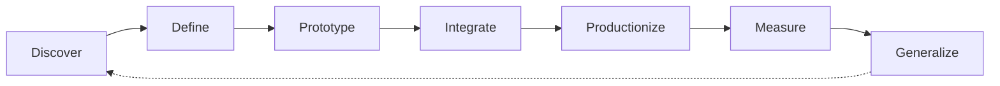

# Awesome FDE Resources

> A curated collection of tools, guides, projects, and learning resources
> for becoming a Forward Deployed Engineer.

# What Is a Forward Deployed Engineer?
A Forward Deployed Engineer (FDE) is a software engineer who works closely with customers to understand difficult real-world problems and build working solutions for them.
Unlike a traditional software engineer who mainly builds features from an internal product roadmap, an FDE works closer to the customer. They help identify the problem, design the solution, write and integrate the software, deploy it in the customer’s environment, and measure whether it creates value.
An FDE may:
- Interview users and understand their workflows
- Turn unclear business problems into technical requirements
- Build applications, integrations, data pipelines, or AI agents
- Connect products to APIs, databases, identity systems, and cloud platforms
- Test, deploy, monitor, and improve production systems
- Communicate with both technical and nontechnical stakeholders
- Convert customer-specific solutions into reusable product features

### The FDE Delivery Cycle

The exact responsibilities vary by company. Some FDEs focus on AI applications, while others specialise in product development, enterprise integration, infrastructure, security, industry-specific systems, or technical pre-sales. Therefore, an FDE role should be judged by its actual responsibilities—not only by its title.

## Before You Begin — Engineering Foundations

## Prerequisites — Engineering Foundations

> Start here if you are new to programming or software development. You do not need to master every topic before continuing, but you should be comfortable with the fundamentals.

### Python

- [The Python Tutorial](https://docs.python.org/3/tutorial/) — The official introduction to Python syntax, data structures, functions, modules, exceptions, and classes.
- [Automate the Boring Stuff with Python](https://automatetheboringstuff.com/) — A practical introduction to Python through small automation projects.

### Git and GitHub

- [Getting Started with Git](https://docs.github.com/en/get-started/learning-to-code/getting-started-with-git) — GitHub’s beginner guide to repositories, commits, branches, and pull requests.
- [Introduction to GitHub](https://github.com/skills/introduction-to-github) — A hands-on exercise completed inside a real GitHub repository.

### Command Line

- [Command Line Crash Course](https://developer.mozilla.org/en-US/docs/Learn_web_development/Getting_started/Environment_setup/Command_line) — An introduction to navigating directories, managing files, and running commands.
- [The Missing Semester: The Shell](https://missing.csail.mit.edu/2020/course-shell/) — A practical introduction to shells, paths, pipes, arguments, and command-line tools.

### JSON and HTTP

- [Working with JSON](https://developer.mozilla.org/en-US/docs/Learn_web_development/Core/Scripting/JSON) — Explains how JSON represents and exchanges structured information.
- [An Overview of HTTP](https://developer.mozilla.org/en-US/docs/Web/HTTP/Guides/Overview) — Introduces requests, responses, methods, headers, status codes, and clients.

### Environments and Packages

- [Installing Packages with pip and venv](https://packaging.python.org/en/latest/guides/installing-using-pip-and-virtual-environments/) — Shows how to isolate Python projects and manage their dependencies.
- [Python Environment Variables](https://docs.python.org/3/library/os.html#os.environ) — The official reference for reading environment variables in Python.

### Debugging and Testing

- [Python Debugging with pdb](https://docs.python.org/3/library/pdb.html) — The official guide to inspecting and debugging running Python programs.
- [Get Started with pytest](https://docs.pytest.org/en/stable/getting-started.html) — A short tutorial on writing and running automated Python tests.

### Ready to Continue?

You are ready for Week 1 when you can:

- Write and run a small Python program
- install a package inside a virtual environment
- navigate files using a terminal
- read a basic JSON object
- recognise an HTTP request and response
- create a Git commit and push it to GitHub
- write and run one basic automated test

## The Forward Deployed Engineer’s Quest

## Week 1 — Learn How Systems Talk
> Learn how applications exchange data, react to events, manage permissions,
> and store information.

# Enterprise Integration

## What is it?

Enterprise integration means connecting different applications, services, databases, and devices so that they can exchange information and support one complete business workflow.

For example, a customer-support solution might connect:

Support ticket system → AI service → customer database → Slack notification

These systems may belong to different companies, use different data formats, and require different authentication methods.

## Why does an FDE need it?

FDEs usually deploy solutions inside an organisation that already has many systems. They rarely get to build everything from scratch.
An FDE needs enterprise integration to:
- Connect a product to customer systems
- Move data safely between applications
- Work with old and modern software
- Translate incompatible data formats
- Automate multi-step business processes
- Handle permissions and security requirements
- Design for unavailable or unreliable external systems

Without integration knowledge, an FDE may build a good demonstration that cannot function inside the customer’s real environment.

## What should you learn?

Focus on:
- How data moves between systems
- Synchronous and asynchronous communication
- APIs and webhooks
- Messages, events, and queues
- Data transformation
- Authentication and permissions
- Integration workflows
- Handling failures and duplicate events
- Monitoring integrations
You only need a general understanding for now. APIs, webhooks and OAuth will each be covered separately.

#### Resources

- [Get Started with Integration Architecture Design](https://learn.microsoft.com/en-us/azure/architecture/integration/integration-start-here) — Introduces how applications, data, services, and devices are connected across enterprise environments.

- [Enterprise Integration Patterns](https://www.oneio.cloud/blog/what-are-enterprise-integration-patterns) — Provides standard patterns and terminology for solving recurring integration problems.

- [Messaging Patterns Overview](https://www.enterpriseintegrationpatterns.com/patterns/messaging/) — Explains how messages are created, transported, routed, and transformed between applications.

# REST APIs

A REST API allows one software application to request data or actions from
another application over HTTP.

For example, an FDE might use an API to retrieve customer records, create a
support ticket, update an order, or send information to an AI service.

FDEs need REST API skills because APIs are one of the most common ways to
connect products with customer systems.

### What to Learn

- Resources and endpoints
- HTTP methods: `GET`, `POST`, `PUT`, `PATCH`, and `DELETE`
- Request headers, parameters, and JSON bodies
- HTTP status codes
- Authentication
- Pagination and filtering
- Rate limits
- Timeouts and error handling
- API documentation
- API versioning

#### Resources

- [What is a REST APIs?](https://youtu.be/lsMQRaeKNDk?si=umysg7lb9jX0GMYn) — What is a REST API? What are the benefits and how are they fundamental to your cloud application? .

- [An Overview of HTTP](https://developer.mozilla.org/en-US/docs/Web/HTTP/Guides/Overview) — Introduces HTTP requests, responses, methods, headers, and status codes.

- [Best Practices for RESTful Web API Design](https://learn.microsoft.com/en-us/azure/architecture/best-practices/api-design) — Explains resource design, HTTP operations, pagination, versioning, and error handling.

- [Getting Started with the GitHub REST API](https://docs.github.com/en/rest/using-the-rest-api/getting-started-with-the-rest-api) — Demonstrates how to authenticate, send requests, use parameters, and process API responses.

- [Postman: Send Your First API Request](https://learning.postman.com/docs/getting-started/first-steps/sending-the-first-request/) — A practical introduction to testing an API without first writing an application.

- [JSONPlaceholder](https://jsonplaceholder.typicode.com/) — A free practice API that can be used without creating an account.

#### Practice

Use JSONPlaceholder or another public API to:

1. Send a `GET` request and retrieve a list of records.
2. Retrieve one record using its identifier.
3. Send a `POST` request containing JSON.
4. Print the response status code and body.
5. Handle an unsuccessful response without crashing.
6. Explain what data was sent and received.

# Webhooks

A webhook allows one application to notify another application immediately
when an event occurs.

Unlike an API request, where your application asks for information, a webhook
sends information to your application automatically.

For example:

> A customer submits a support ticket → the ticketing system sends a webhook →
> your application starts processing the ticket.

FDEs need webhooks to build event-driven integrations that respond to customer
activity in real time.

## What to Learn

- Webhook events and payloads
- Webhook endpoints
- HTTP `POST` requests
- Event types
- Secrets and signature validation
- Fast acknowledgement
- Duplicate deliveries
- Replay protection
- Retries and redelivery
- Asynchronous processing
- Logging and monitoring

#### Resources

- [What is a Webhooks](https://youtu.be/mrkQ5iLb4DM?si=8UVUrY-mk6Ep5zyZ) — Webhook Introductions.

- [About Webhooks](https://docs.github.com/en/webhooks/about-webhooks) — Introduces webhook events, payloads, deliveries, and endpoints.

- [Best Practices for Using Webhooks](https://docs.github.com/en/webhooks/using-webhooks/best-practices-for-using-webhooks) — Covers secrets, HTTPS, event validation, response timing, redelivery, and replay protection.

- [Validating Webhook Deliveries](https://docs.github.com/en/webhooks/using-webhooks/validating-webhook-deliveries) — Explains how to verify that a webhook genuinely came from the expected sender.

- [Handling Failed Webhook Deliveries](https://docs.github.com/en/webhooks/using-webhooks/handling-failed-webhook-deliveries) — Shows how failed events can be identified and delivered again.

- [Webhook.site](https://webhook.site/) — Provides a temporary endpoint for receiving and inspecting webhook requests.

#### Practice

Use Webhook.site or a small local application to:

1. Create an endpoint that accepts `POST` requests.
2. Send a test webhook containing JSON.
3. Read the event type and payload.
4. Return a successful `2XX` response quickly.
5. Detect when the same event is delivered twice.
6. Reject a request with an invalid signature.
7. Record enough information to investigate a failed delivery.
