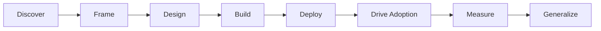

# Awesome FDE Resources

> A curated collection of resources for Forward Deployed Engineers who
> discover customer problems and deliver production AI solutions.

## Contents

- [What Is a Forward Deployed Engineer?](#what-is-a-forward-deployed-engineer)
- [The FDE Journey](#the-fde-journey)
- [Discover the Customer Problem](#discover-the-customer-problem)
- [Frame the Opportunity](#frame-the-opportunity)
- [Design the AI Solution](#design-the-ai-solution)
- [Build and Evaluate](#build-and-evaluate)
- [Deploy into the Enterprise](#deploy-into-the-enterprise)
- [Drive Adoption](#drive-adoption)
- [Measure Business Outcomes](#measure-business-outcomes)
- [Turn Field Learning into Product](#turn-field-learning-into-product)
- [Case Studies and Reference Implementations](#case-studies-and-reference-implementations)
- [FDE Careers and Teamcraft](#fde-careers-and-teamcraft)
- [Technical Foundations](#technical-foundations)

## What Is a Forward Deployed Engineer?

A Forward Deployed Engineer works closely with customers to understand
important operational problems and build solutions that create measurable
business value.

The role combines:

- Customer discovery and strategic advisory
- Software and AI engineering
- Enterprise integration and deployment
- Stakeholder communication and product judgment
- Adoption, measurement, and continuous improvement

## The FDE Journey

## Discover the Customer Problem

An FDE should not begin with a model, agent, or technical architecture. The
first step is to understand how the customer currently works, where the
problem occurs, and why it matters.

A customer’s initial request may describe a desired feature rather than the
underlying problem. Through conversations and observation, the FDE turns that
request into a clear problem statement supported by evidence.

### What the FDE Investigates

- Who experiences the problem?
- What outcome are they trying to achieve?
- How does the existing workflow operate?
- Where do delays, errors, costs, or repetitive tasks occur?
- Which systems, data, and teams are involved?
- What has already been attempted?
- What technical, security, or organizational constraints exist?
- How does the customer currently measure the problem?
- What would a successful outcome look like?
- Is AI actually necessary for solving it?

### Customer Discovery Activities

#### Stakeholder Interviews

Speak with users, decision-makers, technical teams, and process owners. Their
perspectives may differ, so the FDE should identify both shared goals and
conflicting expectations.

#### Workflow Observation

Examine how the work is actually completed instead of relying only on how the
process is described. Record the steps, handoffs, tools, decisions, delays,
exceptions, and manual workarounds.

#### Root-Cause Analysis

Separate visible symptoms from their underlying causes. A slow process, for
example, may result from missing data or approval bottlenecks rather than a
lack of automation.

#### Constraint Discovery

Identify limitations involving data access, privacy, security, compliance,
integrations, budget, deployment environments, and organizational readiness.

#### Success Definition

Agree on measurable outcomes before building. Useful measures might include
time saved, reduced error rates, faster resolution, increased completion
rates, lower costs, or improved user satisfaction.

### Customer Problem Brief

Before designing a solution, the FDE should be able to summarize:

> **[User or team] struggles to [complete an important activity] because
> [evidence-backed cause], resulting in [measurable impact]. A successful
> outcome would [observable improvement], subject to [important constraints].**

### Discovery Output

Customer discovery should produce:

- A clearly defined customer problem
- A map of the current workflow
- Identified users and stakeholders
- Evidence of the problem’s impact
- Known technical and organizational constraints
- Initial assumptions that still need validation
- Agreed success measures
- A decision on whether the opportunity should proceed

### Resources

- [Learning About Users and Their Needs](https://www.gov.uk/service-manual/user-research/start-by-learning-user-needs) — Guidance for identifying users, investigating how they currently work, and expressing needs as outcomes rather than proposed features.

- [Writing an Effective Guide for a User Interview](https://www.nngroup.com/articles/interview-guide/) — A practical process for preparing open-ended interview questions, follow-up prompts, and a pilot interview.

- [Creating an Experience Map](https://www.gov.uk/service-manual/user-research/creating-an-experience-map/) — Explains how to map users’ actions, experiences, pain points, teams, and service dependencies over time.

- [5 Whys Analysis](https://www.atlassian.com/team-playbook/plays/5-whys) — A facilitated exercise for investigating the underlying causes of a problem instead of responding only to its symptoms.

- [Framework for Innovation](https://www.designcouncil.org.uk/resources/framework-for-innovation/) — Introduces the Double Diamond approach for exploring a problem broadly, defining the right challenge, developing possibilities, and testing solutions.

## Frame the Opportunity

After discovering the customer’s problem, an FDE must decide whether it
represents a valuable and feasible opportunity—especially whether AI is an
appropriate part of the solution.

This stage converts discovery findings into a focused use case that the
customer and delivery team can evaluate.

### What the FDE Defines

- The users and workflow being addressed
- The business impact of the current problem
- The specific task AI might perform
- Why AI is preferable to rules, automation, or process improvement
- The data and system access required
- Expected quality, latency, cost, and safety requirements
- Human-review and escalation requirements
- Technical and organizational risks
- A small first deployment or pilot
- Measurable success and stop criteria

### Opportunity Assessment

Evaluate each proposed use case across:

| Dimension | Question |
| --- | --- |
| User value | Does this solve an important user problem? |
| Business impact | Will it save time, reduce cost, increase revenue, or reduce risk? |
| AI suitability | Does the task benefit from language, reasoning, generation, or classification? |
| Data readiness | Is relevant, lawful, and sufficiently reliable data available? |
| Technical feasibility | Can it integrate with the customer’s existing environment? |
| Risk | What happens when the system produces an incorrect result? |
| Adoption | Will users trust it and incorporate it into their workflow? |
| Measurability | Can improvement be demonstrated using agreed metrics? |
| Reusability | Could the solution or its components benefit other customers? |

### Opportunity Brief

Before designing the system, summarize the opportunity:

> **For [target users], we will improve [existing workflow] by using AI to
> [specific task]. We expect to improve [business or user measure] from
> [baseline] to [target]. The initial scope includes [boundaries], requires
> [data and integrations], and will use [human oversight] to manage
> [principal risks].**

### Resources

- [Identifying and Scaling AI Use Cases](https://openai.com/business/guides-and-resources/identifying-and-scaling-ai-use-cases/) — A practical guide to finding AI opportunities in business workflows and prioritizing them using expected impact and implementation effort.

- [Project Poster](https://www.atlassian.com/team-playbook/plays/project-poster) — A collaborative method for documenting the problem, assumptions, possible solutions, scope, and intended result before committing to delivery.

- [Define What Success Looks Like](https://www.gov.uk/service-manual/service-standard/point-10-define-success-publish-performance-data) — Guidance for selecting measures that demonstrate whether a service is solving its intended problem.
  
## Design the AI Solution

## Build and Evaluate

## Deploy into the Enterprise

## Drive Adoption

## Measure Business Outcomes

## Turn Field Learning into Product

## Case Studies and Reference Implementations

## FDE Careers and Teamcraft

## Technical Foundations
