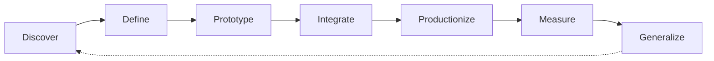
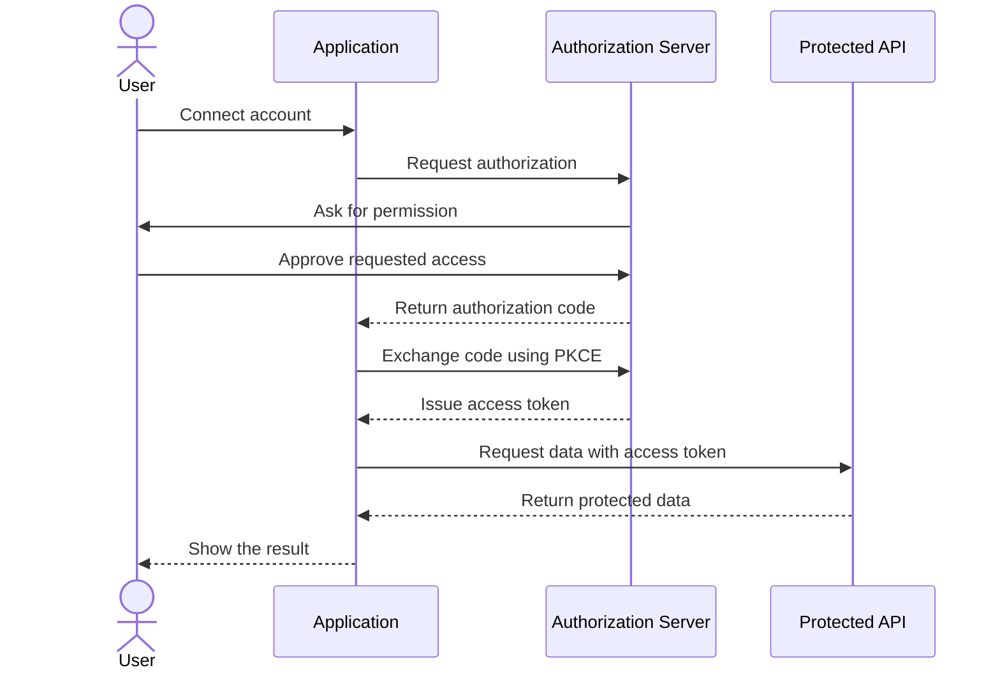
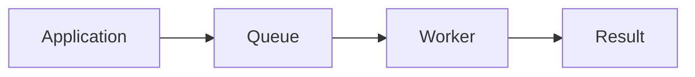

# Awesome FDE Resources

> A curated collection of tools, guides, projects, and learning resources
> for becoming a Forward Deployed Engineer.

# What Is a Forward Deployed Engineer?
A Forward Deployed Engineer (FDE) is a software engineer who works closely with customers to understand difficult real-world problems and build working solutions for them.
Unlike a traditional software engineer who mainly builds features from an internal product roadmap, an FDE works closer to the customer. They help identify the problem, design the solution, write and integrate the software, deploy it in the customer’s environment, and measure whether it creates value.
An FDE may:
- Interview users and understand their workflows
- Turn unclear business problems into technical requirements
- Build applications, integrations, data pipelines, or AI agents
- Connect products to APIs, databases, identity systems, and cloud platforms
- Test, deploy, monitor, and improve production systems
- Communicate with both technical and nontechnical stakeholders
- Convert customer-specific solutions into reusable product features

### The FDE Delivery Cycle

The exact responsibilities vary by company. Some FDEs focus on AI applications, while others specialise in product development, enterprise integration, infrastructure, security, industry-specific systems, or technical pre-sales. Therefore, an FDE role should be judged by its actual responsibilities—not only by its title.

## Before You Begin — Engineering Foundations

## Prerequisites — Engineering Foundations

> Start here if you are new to programming or software development. You do not need to master every topic before continuing, but you should be comfortable with the fundamentals.

### Python

- [The Python Tutorial](https://docs.python.org/3/tutorial/) — The official introduction to Python syntax, data structures, functions, modules, exceptions, and classes.
- [Automate the Boring Stuff with Python](https://automatetheboringstuff.com/) — A practical introduction to Python through small automation projects.

### Git and GitHub

- [Getting Started with Git](https://docs.github.com/en/get-started/learning-to-code/getting-started-with-git) — GitHub’s beginner guide to repositories, commits, branches, and pull requests.
- [Introduction to GitHub](https://github.com/skills/introduction-to-github) — A hands-on exercise completed inside a real GitHub repository.

### Command Line

- [Command Line Crash Course](https://developer.mozilla.org/en-US/docs/Learn_web_development/Getting_started/Environment_setup/Command_line) — An introduction to navigating directories, managing files, and running commands.
- [The Missing Semester: The Shell](https://missing.csail.mit.edu/2020/course-shell/) — A practical introduction to shells, paths, pipes, arguments, and command-line tools.

### JSON and HTTP

- [Working with JSON](https://developer.mozilla.org/en-US/docs/Learn_web_development/Core/Scripting/JSON) — Explains how JSON represents and exchanges structured information.
- [An Overview of HTTP](https://developer.mozilla.org/en-US/docs/Web/HTTP/Guides/Overview) — Introduces requests, responses, methods, headers, status codes, and clients.

### Environments and Packages

- [Installing Packages with pip and venv](https://packaging.python.org/en/latest/guides/installing-using-pip-and-virtual-environments/) — Shows how to isolate Python projects and manage their dependencies.
- [Python Environment Variables](https://docs.python.org/3/library/os.html#os.environ) — The official reference for reading environment variables in Python.

### Debugging and Testing

- [Python Debugging with pdb](https://docs.python.org/3/library/pdb.html) — The official guide to inspecting and debugging running Python programs.
- [Get Started with pytest](https://docs.pytest.org/en/stable/getting-started.html) — A short tutorial on writing and running automated Python tests.

### Ready to Continue?

You are ready for Week 1 when you can:

- Write and run a small Python program
- install a package inside a virtual environment
- navigate files using a terminal
- read a basic JSON object
- recognise an HTTP request and response
- create a Git commit and push it to GitHub
- write and run one basic automated test

## The Forward Deployed Engineer’s Quest

## Week 1 — Learn How Systems Talk
> Learn how applications exchange data, react to events, manage permissions,
> and store information.

# Enterprise Integration

## What is it?

Enterprise integration means connecting different applications, services, databases, and devices so that they can exchange information and support one complete business workflow.

For example, a customer-support solution might connect:

Support ticket system → AI service → customer database → Slack notification

These systems may belong to different companies, use different data formats, and require different authentication methods.

## Why does an FDE need it?

FDEs usually deploy solutions inside an organisation that already has many systems. They rarely get to build everything from scratch.
An FDE needs enterprise integration to:
- Connect a product to customer systems
- Move data safely between applications
- Work with old and modern software
- Translate incompatible data formats
- Automate multi-step business processes
- Handle permissions and security requirements
- Design for unavailable or unreliable external systems

Without integration knowledge, an FDE may build a good demonstration that cannot function inside the customer’s real environment.

## What should you learn?

Focus on:
- How data moves between systems
- Synchronous and asynchronous communication
- APIs and webhooks
- Messages, events, and queues
- Data transformation
- Authentication and permissions
- Integration workflows
- Handling failures and duplicate events
- Monitoring integrations
You only need a general understanding for now. APIs, webhooks and OAuth will each be covered separately.

#### Resources

- [Get Started with Integration Architecture Design](https://learn.microsoft.com/en-us/azure/architecture/integration/integration-start-here) — Introduces how applications, data, services, and devices are connected across enterprise environments.

- [Enterprise Integration Patterns](https://www.oneio.cloud/blog/what-are-enterprise-integration-patterns) — Provides standard patterns and terminology for solving recurring integration problems.

- [Messaging Patterns Overview](https://www.enterpriseintegrationpatterns.com/patterns/messaging/) — Explains how messages are created, transported, routed, and transformed between applications.

# REST APIs

A REST API allows one software application to request data or actions from
another application over HTTP.

For example, an FDE might use an API to retrieve customer records, create a
support ticket, update an order, or send information to an AI service.

FDEs need REST API skills because APIs are one of the most common ways to
connect products with customer systems.

### What to Learn

- Resources and endpoints
- HTTP methods: `GET`, `POST`, `PUT`, `PATCH`, and `DELETE`
- Request headers, parameters, and JSON bodies
- HTTP status codes
- Authentication
- Pagination and filtering
- Rate limits
- Timeouts and error handling
- API documentation
- API versioning

#### Resources

- [What is a REST APIs?](https://youtu.be/lsMQRaeKNDk?si=umysg7lb9jX0GMYn) — What is a REST API? What are the benefits and how are they fundamental to your cloud application? .

- [An Overview of HTTP](https://developer.mozilla.org/en-US/docs/Web/HTTP/Guides/Overview) — Introduces HTTP requests, responses, methods, headers, and status codes.

- [Best Practices for RESTful Web API Design](https://learn.microsoft.com/en-us/azure/architecture/best-practices/api-design) — Explains resource design, HTTP operations, pagination, versioning, and error handling.

- [Getting Started with the GitHub REST API](https://docs.github.com/en/rest/using-the-rest-api/getting-started-with-the-rest-api) — Demonstrates how to authenticate, send requests, use parameters, and process API responses.

- [Postman: Send Your First API Request](https://learning.postman.com/docs/getting-started/first-steps/sending-the-first-request/) — A practical introduction to testing an API without first writing an application.

- [JSONPlaceholder](https://jsonplaceholder.typicode.com/) — A free practice API that can be used without creating an account.

#### Practice

Use JSONPlaceholder or another public API to:

1. Send a `GET` request and retrieve a list of records.
2. Retrieve one record using its identifier.
3. Send a `POST` request containing JSON.
4. Print the response status code and body.
5. Handle an unsuccessful response without crashing.
6. Explain what data was sent and received.

# Webhooks

A webhook allows one application to notify another application immediately
when an event occurs.

Unlike an API request, where your application asks for information, a webhook
sends information to your application automatically.

For example:

> A customer submits a support ticket → the ticketing system sends a webhook →
> your application starts processing the ticket.

FDEs need webhooks to build event-driven integrations that respond to customer
activity in real time.

## What to Learn

- Webhook events and payloads
- Webhook endpoints
- HTTP `POST` requests
- Event types
- Secrets and signature validation
- Fast acknowledgement
- Duplicate deliveries
- Replay protection
- Retries and redelivery
- Asynchronous processing
- Logging and monitoring

#### Resources

- [What is a Webhooks?](https://youtu.be/mrkQ5iLb4DM?si=8UVUrY-mk6Ep5zyZ) — Webhook Introductions.

- [About Webhooks](https://docs.github.com/en/webhooks/about-webhooks) — Introduces webhook events, payloads, deliveries, and endpoints.

- [Best Practices for Using Webhooks](https://docs.github.com/en/webhooks/using-webhooks/best-practices-for-using-webhooks) — Covers secrets, HTTPS, event validation, response timing, redelivery, and replay protection.

- [Validating Webhook Deliveries](https://docs.github.com/en/webhooks/using-webhooks/validating-webhook-deliveries) — Explains how to verify that a webhook genuinely came from the expected sender.

- [Handling Failed Webhook Deliveries](https://docs.github.com/en/webhooks/using-webhooks/handling-failed-webhook-deliveries) — Shows how failed events can be identified and delivered again.

- [Webhook.site](https://webhook.site/) — Provides a temporary endpoint for receiving and inspecting webhook requests.

#### Practice

Use Webhook.site or a small local application to:

1. Create an endpoint that accepts `POST` requests.
2. Send a test webhook containing JSON.
3. Read the event type and payload.
4. Return a successful `2XX` response quickly.
5. Detect when the same event is delivered twice.
6. Reject a request with an invalid signature.
7. Record enough information to investigate a failed delivery.

# OAuth

OAuth is an authorization framework that allows one application to access
another service on behalf of a user without receiving the user's password.

For example, an FDE application might request permission to read tickets from
a customer's support platform. The customer approves the request, and the
platform gives the application a limited access token.

FDEs need OAuth because most enterprise integrations involve protected APIs,
user permissions, identity providers, and sensitive customer data.

## What to Learn

- Authorization versus authentication
- Clients and authorization servers
- Resource owners and protected APIs
- Access tokens and refresh tokens
- Permission scopes
- Redirect URIs
- Authorization Code flow
- Proof Key for Code Exchange (PKCE)
- Token expiration and revocation
- Secure token storage
- Service-to-service authorization
- OAuth versus OpenID Connect

#### Resources
- [What is Oauth?](https://youtu.be/t4-416mg6iU?si=fyyImMgBlDln-YxK) — What is OAuth really all about, OAuth tutorial

- [OAuth 2.0 Overview](https://oauth.net/2/) — Introduces OAuth roles, tokens, scopes, clients, and authorization flows.

- [Authorization Code Flow](https://oauth.net/2/grant-types/authorization-code/) — Explains how users authorize an application to access their account or data.

- [Proof Key for Code Exchange](https://oauth.net/2/pkce/) — Explains how PKCE protects the Authorization Code flow from intercepted or injected authorization codes.

- [OAuth 2.1](https://oauth.net/2.1/) — Summarizes modern OAuth security practices and the removal of older, unsafe flows.

- [Microsoft Identity Platform Protocols](https://learn.microsoft.com/en-us/entra/identity-platform/v2-protocols) — Provides practical documentation for OAuth 2.0 and OpenID Connect flows.

#### Practice

Create a diagram showing this authorization process like this:

Then use an OAuth-enabled test application to:

1. Redirect a user to an authorization page.
2. Request only the scopes the application needs.
3. Receive an authorization code through a redirect URI.
4. Exchange the code for an access token using PKCE.
5. Use the access token to call a protected API.
6. Handle an expired or rejected token safely.

Never place client secrets, access tokens, or refresh tokens in source code or
commit them to GitHub.

# SQL

SQL, or Structured Query Language, is used to store, retrieve, update, and
relate information in a relational database.

For example, an FDE might use SQL to combine customer records with support
tickets, investigate failed transactions, or measure whether a deployed
solution is producing the intended result.

FDEs need SQL because customer data is frequently stored in relational
databases, and understanding that data is essential for integrations,
analytics, debugging, and production applications.

## What to Learn

- Tables, rows, and columns
- Data types
- Primary and foreign keys
- `SELECT`, `INSERT`, `UPDATE`, and `DELETE`
- Filtering with `WHERE`
- Sorting and limiting results
- `INNER JOIN` and `LEFT JOIN`
- Aggregate functions
- `GROUP BY`
- Database constraints
- Transactions
- Indexes
- Parameterized queries
- Basic query performance

#### Resources
- [SQL Basics](https://youtu.be/7S_tz1z_5bA?si=TGy8l4hy8dvJvAlt) - SQL introduction and tutorial

- [PostgreSQL Tutorial](https://www.postgresql.org/docs/current/tutorial.html) — The official introduction to relational databases, SQL queries, joins, aggregates, foreign keys, and transactions.

- [SQLBolt](https://sqlbolt.com/) — Provides short interactive lessons covering essential SQL concepts and queries.

- [Select Star SQL](https://selectstarsql.com/) — An interactive SQL tutorial that uses real-world datasets.

- [PostgreSQL SQL Language](https://www.postgresql.org/docs/current/sql.html) — A detailed reference for SQL syntax, data types, functions, queries, and database operations.

- [DB Fiddle](https://www.db-fiddle.com/) — An online environment for creating tables and testing SQL queries without a local database.

#### Practice

Create two related tables:

- `customers`
- `support_tickets`

Then write queries that:

1. Add customers and support tickets.
2. Retrieve all open tickets.
3. Find every ticket belonging to a particular customer.
4. Count tickets by status.
5. Join customers with their tickets.
6. Update a ticket from `open` to `resolved`.
7. Perform two related updates inside a transaction.
8. Safely handle user input with a parameterized query.

Avoid building SQL queries by joining user-provided text directly into the
query. Use parameterized queries to reduce the risk of SQL injection.

## Week 2 — Build Systems That Bounce Back

# Background Jobs

A background job is work that an application performs outside the main
request-response cycle.

Instead of making a user wait while a long task finishes, the application
records the task, returns a response, and lets a separate worker process it.

Common background jobs include:

- Processing uploaded files
- Sending emails and notifications
- Synchronizing customer data
- Generating reports
- Running AI evaluations
- Creating embeddings
- Processing webhook events

FDEs need background-job knowledge because customer integrations often involve
slow, unreliable, or high-volume operations that should not block the main
application.

## How Background Jobs Work

The application places a job in a queue. A worker retrieves the job, performs
the work, and records whether it succeeded or failed.

#### What to Learn

- Synchronous versus asynchronous processing
- Tasks, queues, workers, and message brokers
- Job identifiers and status tracking
- Scheduled and delayed jobs
- Job acknowledgements
- Retries and timeouts
- Failed jobs and dead-letter queues
- Idempotent job processing
- Logging and monitoring
- Protecting sensitive job data

#### Resources

- [Asynchronous Communication](https://docs.aws.amazon.com/prescriptive-guidance/latest/modernization-integrating-microservices/asynchronous.html) — Explains why asynchronous processing improves fault isolation, resource management, and handling of traffic spikes.

- [Introduction to Celery](https://docs.celeryq.dev/en/stable/getting-started/introduction.html) — Introduces task queues, message brokers, workers, and distributed background processing with Python.

- [First Steps with Celery](https://docs.celeryq.dev/en/stable/getting-started/first-steps-with-celery.html) — A practical tutorial for creating a task, starting a worker, and tracking its result.

- [Process Events Asynchronously](https://docs.aws.amazon.com/prescriptive-guidance/latest/patterns/process-events-asynchronously-with-amazon-api-gateway-amazon-sqs-and-aws-fargate.html) — Demonstrates how an API can accept a job, place it in a queue, process it with a worker, and expose its status.

- [What Is a Message Queue? — IBM Technology](https://www.youtube.com/watch?v=xErwDaOc-Gs) — A visual introduction to queues, producers, consumers, asynchronous messaging, and common business use cases.

#### Practice

Create a background job that processes a support ticket:

1. Accept a support ticket through an API.
2. Create a unique job identifier.
3. Place the ticket-processing job in a queue.
4. Return an `accepted` response without waiting for completion.
5. Let a worker classify the ticket.
6. Store the job status and result.
7. Provide an endpoint for checking the job status.
8. Record and expose a safe error when processing fails.

Do not place passwords, access tokens, or unnecessary customer data inside job
payloads.

### Retries

A retry is a repeated attempt to complete an operation after a temporary
failure.

For example, if a customer API is briefly unavailable, an application can
wait and try the request again instead of immediately abandoning the task.

FDEs need to understand retries because networks, APIs, databases, and cloud
services can fail temporarily. Carefully designed retries help integrations
recover without manual intervention.

#### What to Learn

- Temporary versus permanent failures
- Retryable and non-retryable errors
- Retry limits
- Timeouts
- Exponential backoff
- Jitter
- Rate-limit responses
- Idempotent operations
- Dead-letter queues
- Retry logging and monitoring

#### Resources

- [Computer Networks: Crash Course Computer Science #28](https://www.youtube.com/watch?v=3QhU9jd03a0) — Explains network failures, collisions, randomized waiting, and exponential backoff.

- [Retry Pattern](https://learn.microsoft.com/en-us/azure/architecture/patterns/retry) — Introduces retry strategies, transient failures, retry limits, and situations where an operation should fail immediately.

- [Timeouts, Retries, and Backoff with Jitter](https://builder.aws.com/content/3EumjoZascWd1oZiEgL8ORlv3qE/timeouts-retries-and-backoff-with-jitter) — Explains how Amazon designs retries without overwhelming a recovering service.

- [Control and Limit Retry Calls](https://docs.aws.amazon.com/wellarchitected/latest/framework/rel_mitigate_interaction_failure_limit_retries.html) — Provides practical guidance on retry limits, exponential backoff, jitter, and testing.

- [Transient Fault Handling](https://learn.microsoft.com/en-us/azure/architecture/best-practices/transient-faults) — Explains how to identify temporary failures and select an appropriate retry strategy.

#### Practice

Create a program that calls a test API and:

1. Retries temporary failures.
2. Waits longer after every unsuccessful attempt.
3. Adds a small random delay between attempts.
4. stops after a defined number of retries.
5. does not retry invalid requests or authorization failures.
6. logs each attempt and the final result.

# Idempotency

Idempotency means that repeating the same operation produces no additional
effect after the first successful operation.

For example, if a payment request is submitted twice with the same idempotency
key, the customer should still be charged only once.

FDEs need idempotency because API requests, webhook events, and background jobs
can be delivered more than once. Without it, retries may create duplicate
orders, records, notifications, or payments.

#### What to Learn

- Naturally idempotent HTTP methods
- Idempotency keys
- Duplicate request detection
- Storing request results
- Returning previous results
- Request-key expiration
- Concurrent duplicate requests
- Idempotent event consumers
- Database uniqueness constraints
- Safe retries

#### Resources

- [What Is Idempotency?](https://cloud.google.com/discover/idempotency) — Introduces idempotency using APIs, payments, retries, and duplicate requests.

- [Making Retries Safe with Idempotent APIs](https://aws.amazon.com/builders-library/making-retries-safe-with-idempotent-APIs/) — Explains how AWS uses client request identifiers to prevent repeated operations from creating additional effects.

- [Idempotent Requests](https://docs.stripe.com/api/idempotent_requests) — Shows how a production payment API uses idempotency keys to make repeated requests safe.

- [Make Mutating Operations Idempotent](https://docs.aws.amazon.com/wellarchitected/latest/reliability-pillar/rel_prevent_interaction_failure_idempotent.html) — Provides implementation guidance for designing reliable idempotent operations.

- [Build a Robust Payments Service Using Idempotency Keys](https://www.youtube.com/watch?v=m6DtqSb1BDM) — Explains how idempotency keys prevent duplicate payment processing.

#### Practice

Create an order endpoint that:

1. Accepts an idempotency key with every order request.
2. Stores the key, request information, and result.
3. Creates the order when the key is new.
4. Returns the original result when the same request is repeated.
5. Rejects the key if it is reused with different request data.
6. Prevents simultaneous requests from creating duplicate orders.
