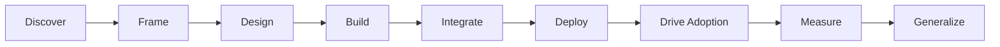

# Awesome FDE Resources

> A curated collection of resources for Forward Deployed Engineers who discover customer problems, build production systems, integrate them into real environments, and deliver measurable business outcomes.

Forward Deployed Engineering sits at the intersection of:

* Customer discovery
* Software and AI engineering
* Enterprise integrations
* Production deployment
* Stakeholder communication
* Product judgment
* Adoption
* Business impact
* Field-to-product learning

This collection is organized around the actual journey of taking a customer problem from ambiguity to production.

**Last reviewed:** September 2026

---

## How to Use This Collection

You do not need to complete every resource.

If you are new to Forward Deployed Engineering, a useful path is:

**Understand the role → Discover the problem → Design the solution → Build & evaluate → Integrate → Deploy → Drive adoption → Measure impact → Generalize what you learn**

Use the **Core Resources** to understand each stage.

Use the **Technical Foundations** and **FDE Toolbox** when you need implementation depth.

Use the **FDE Playbook** as a practical checklist while working on an engagement.

---

## The FDE Journey



---

## Contents

1. [Understanding the FDE Role](#1-understanding-the-fde-role)
2. [Customer Discovery & Problem Framing](#2-customer-discovery--problem-framing)
3. [Solution Design](#3-solution-design)
4. [Building & Evals](#4-building--evals)
5. [Integrations & Enterprise Engineering](#5-integrations--enterprise-engineering)
6. [Production & Deployment](#6-production--deployment)
7. [Working With Customers & Stakeholders](#7-working-with-customers--stakeholders)
8. [Adoption & Change Management](#8-adoption--change-management)
9. [Measuring Business Impact](#9-measuring-business-impact)
10. [Turning Field Learning Into Product](#10-turning-field-learning-into-product)
11. [FDE Case Studies & Reference Implementations](#11-fde-case-studies--reference-implementations)
12. [FDE Careers & Interviews](#12-fde-careers--interviews)
13. [Technical Foundations](#13-technical-foundations)
14. [FDE Playbook](#14-fde-playbook)

---

# 1. Understanding the FDE Role

Forward Deployed Engineers work closely with customers to turn ambiguous, high-value problems into production systems.

Unlike a traditional engineering role where ownership may end when a feature ships, FDEs often remain close to deployment, adoption, customer outcomes, and the lessons that should feed back into the product.

### Core Resources

| Resource                                                                                                                                          | Type                | Why it belongs                                                                                                                      | Covers                                                |
| ------------------------------------------------------------------------------------------------------------------------------------------------- | ------------------- | ----------------------------------------------------------------------------------------------------------------------------------- | ----------------------------------------------------- |
| [Forward Deployed Engineering — Palantir](https://www.palantir.com/docs/foundry/architecture-center/overview)                                     | Primary source      | Introduces one of the original Forward Deployed Engineering models and the relationship between field work and product development. | FDE philosophy, customer proximity, product feedback  |
| [Forward Deployed Engineer — OpenAI](https://openai.com/careers/forward-deployed-engineer-%28fde%29-sf-san-francisco/)                            | Role overview       | Shows what modern AI-focused FDE work looks like across discovery, design, deployment, evaluation, and adoption.                    | Discovery, scoping, implementation, rollout, outcomes |
| [Forward Deployed Engineering — Vannevar Labs](https://vannevarlabs.com/blog/forward-deployed-engineering/)                                       | Engineering article | Explains why engineers embed with users and how field understanding can shape products.                                             | Embedded engineering, iteration, product learning     |
| [The Definitive Guide to Forward Deployed Engineering — Vinoo Ganesh](https://nextplayso.substack.com/p/the-definitive-guide-to-forward-deployed) | Practitioner guide  | Practitioner perspective on the operating model, responsibilities, and common misconceptions around FDE.                            | Customer ownership, career, FDE operating model       |

---

# 2. Customer Discovery & Problem Framing

Before designing a solution, an FDE needs to understand how the customer currently works, where the real problem occurs, and why solving it matters.

Good discovery separates requested features from underlying needs and turns vague problems into measurable opportunities.

### Core Resources

| Resource                                                                                                                                       | Type      | Why it belongs                                                                                          | Covers                                  |
| ---------------------------------------------------------------------------------------------------------------------------------------------- | --------- | ------------------------------------------------------------------------------------------------------- | --------------------------------------- |
| [Learning About Users and Their Needs — GOV.UK](https://www.gov.uk/service-manual/user-research/start-by-learning-user-needs)                  | Guide     | Helps distinguish actual user needs from requested features.                                            | User research, needs, outcomes          |
| [Writing an Effective Guide for a User Interview — Nielsen Norman Group](https://www.nngroup.com/articles/interview-guide/)                    | Guide     | Practical guidance for preparing open-ended stakeholder interviews.                                     | Interview questions, follow-ups, bias   |
| [Creating an Experience Map — GOV.UK](https://www.gov.uk/service-manual/user-research/creating-an-experience-map/)                             | Guide     | Helps map how work moves across users, teams, tools, and dependencies.                                  | Workflow mapping, pain points, handoffs |
| [5 Whys Analysis — Atlassian](https://www.atlassian.com/team-playbook/plays/5-whys)                                                            | Framework | Useful for moving from visible symptoms toward underlying causes.                                       | Root-cause analysis                     |
| [Framework for Innovation — Design Council](https://www.designcouncil.org.uk/resources/framework-for-innovation/)                              | Framework | Introduces the Double Diamond approach for exploring ambiguous problems before committing to solutions. | Discover, define, develop, deliver      |
| [Identifying and Scaling AI Use Cases — OpenAI](https://openai.com/business/guides-and-resources/identifying-and-scaling-ai-use-cases/)        | Guide     | Helps assess where AI can create meaningful business value.                                             | AI suitability, prioritization, impact  |
| [Project Poster — Atlassian](https://www.atlassian.com/team-playbook/plays/project-poster)                                                     | Framework | Helps teams align on the problem, assumptions, scope, and intended outcome.                             | Problem framing, scope, alignment       |
| [Define What Success Looks Like — GOV.UK](https://www.gov.uk/service-manual/service-standard/point-10-define-success-publish-performance-data) | Guide     | Encourages measurable outcomes to be defined before implementation.                                     | Success metrics, baselines, outcomes    |

---

# 3. Solution Design

Once the customer problem is clear, the FDE needs to decide how the solution should actually work.

The goal is not maximum autonomy. The goal is the simplest architecture capable of solving the customer's problem reliably.

### Core Resources

| Resource                                                                                                                                      | Type               | Why it belongs                                                                                     | Covers                                          |
| --------------------------------------------------------------------------------------------------------------------------------------------- | ------------------ | -------------------------------------------------------------------------------------------------- | ----------------------------------------------- |
| [A Practical Guide to Building AI Agents — OpenAI](https://openai.com/business/guides-and-resources/a-practical-guide-to-building-ai-agents/) | Guide              | Helps decide when an agent is appropriate and where guardrails or human intervention are required. | Agents, models, tools, instructions, guardrails |
| [Building Effective Agents — Anthropic](https://www.anthropic.com/engineering/building-effective-agents)                                      | Engineering guide  | Strong explanation of workflows versus agents and why simple patterns should come first.           | Routing, workflows, orchestration, agents       |
| [Application Design for AI Workloads — Microsoft](https://learn.microsoft.com/en-us/azure/well-architected/ai/application-design)             | Architecture guide | Expands the design problem beyond the model to the entire production application.                  | Models, orchestration, knowledge, tools, agents |
| [Effective Context Engineering for AI Agents — Anthropic](https://www.anthropic.com/engineering/effective-context-engineering-for-ai-agents)  | Engineering guide  | Explains how context selection and retrieval affect agent reliability.                             | Context, memory, retrieval, tools               |
| [A Visual Guide to Attention Variants in Modern LLMs — Sebastian Raschka](https://magazine.sebastianraschka.com/p/visual-attention-variants)  | Technical guide    | Useful when model architecture or inference constraints materially affect a design decision.       | MHA, GQA, MLA, model architecture               |

### Cohort-Based Learning

| Resource                                                                           | Type                | Why it belongs                                                                          | Covers                                                       |
| ---------------------------------------------------------------------------------- | ------------------- | --------------------------------------------------------------------------------------- | ------------------------------------------------------------ |
| [Mastering Agentic AI](https://maven.com/aishwarya-srinivasan/mastering-ai-agents) | Cohort-based course | End-to-end program covering modern AI application engineering and production readiness. | RAG, agents, MCP, evals, observability, security, production |

*Created by The Gen Academy, the maintainers of this collection.*

---

# 4. Building & Evals

FDEs should build the smallest end-to-end version of a solution that can be tested inside a realistic customer workflow.

The objective is not merely to build a convincing demo. The system needs to perform the intended task consistently, handle important failures, and improve the outcome it was designed for.

### Core Resources

| Resource                                                                                                                                                   | Type               | Why it belongs                                                                              | Covers                                    |
| ---------------------------------------------------------------------------------------------------------------------------------------------------------- | ------------------ | ------------------------------------------------------------------------------------------- | ----------------------------------------- |
| [Working with Evals — OpenAI](https://developers.openai.com/api/docs/guides/evals)                                                                         | Documentation      | Practical starting point for defining datasets, criteria, graders, and comparisons.         | Eval datasets, graders, experiments       |
| [Demystifying Evals for AI Agents — Anthropic](https://www.anthropic.com/engineering/demystifying-evals-for-ai-agents)                                     | Engineering guide  | Strong framework for evaluating agents beyond final-answer quality.                         | Tasks, trials, graders, traces, outcomes  |
| [Production ML Systems: Deployment Testing — Google](https://developers.google.com/machine-learning/crash-course/production-ml-systems/deployment-testing) | Engineering guide  | Shows why production testing includes pipelines and infrastructure, not only model quality. | Integration testing, pipelines, serving   |
| [LLM-as-a-Judge: Complete Guide — Hamel Husain](https://hamel.dev/blog/posts/llm-judge/)                                                                   | Practitioner guide | Practical guidance for using model-based grading without blindly trusting it.               | Rubrics, judge design, calibration, bias  |
| [LLM Evals FAQ — Hamel Husain](https://hamel.dev/blog/posts/evals-faq/)                                                                                    | Reference          | Covers common implementation questions around eval-driven development.                      | Error analysis, sample size, monitoring   |
| [Agent Trajectory Evaluations — LangSmith](https://docs.langchain.com/langsmith/trajectory-evals)                                                          | Documentation      | Useful for evaluating the sequence of tool calls an agent takes.                            | Trajectory evaluation, tool calls, traces |

### Practical Tools

| Tool                                                 | Best for                                                  |
| ---------------------------------------------------- | --------------------------------------------------------- |
| [Promptfoo](https://github.com/promptfoo/promptfoo)  | Prompt, model, agent, and red-team testing                |
| [DeepEval](https://github.com/confident-ai/deepeval) | LLM and agent evaluation in Python                        |
| [Ragas](https://github.com/explodinggradients/ragas) | RAG and agent evaluation                                  |
| [Langfuse](https://github.com/langfuse/langfuse)     | Tracing, prompt management, evaluation, and observability |
| [Arize Phoenix](https://github.com/Arize-ai/phoenix) | Open-source tracing, evaluation, and AI debugging         |

---

# 5. Integrations & Enterprise Engineering

FDEs rarely build systems in isolation.

Solutions usually need to connect with customer APIs, databases, SaaS applications, identity systems, internal tools, and legacy infrastructure.

Strong integration design also considers what happens when tokens expire, events arrive twice, requests fail, schemas change, or one dependency becomes unavailable.

### Core Resources

| Resource                                                                                                                                                       | Type               | Why it belongs                                                                    | Covers                                                   |
| -------------------------------------------------------------------------------------------------------------------------------------------------------------- | ------------------ | --------------------------------------------------------------------------------- | -------------------------------------------------------- |
| [Determine Integration Requirements — Microsoft](https://learn.microsoft.com/en-us/power-platform/architecture/key-concepts/integration-patterns/requirements) | Architecture guide | Helps choose integration patterns based on real system constraints.               | Volume, frequency, directionality, system capability     |
| [Enterprise Integration Patterns](https://www.enterpriseintegrationpatterns.com/)                                                                              | Book / Reference   | Foundational catalogue of recurring enterprise integration problems and patterns. | Messaging, routing, transformation, asynchronous systems |
| [Best Practices for Using Webhooks — GitHub](https://docs.github.com/en/webhooks/using-webhooks/best-practices-for-using-webhooks)                             | Documentation      | Covers practical reliability concerns in event-driven integrations.               | Verification, secrets, redelivery, duplicates            |
| [Idempotent Requests — Stripe](https://docs.stripe.com/api/idempotent_requests)                                                                                | Documentation      | Explains how operations can be safely retried without accidental duplication.     | Idempotency, retries, API safety                         |
| [Authorization Code Flow with PKCE — Auth0](https://auth0.com/docs/get-started/authentication-and-authorization-flow/authorization-code-flow-with-pkce)        | Documentation      | Useful foundation for understanding modern SaaS and API authorization.            | OAuth, PKCE, access tokens                               |
| [Model Context Protocol — Architecture](https://modelcontextprotocol.io/specification/architecture)                                                            | Protocol docs      | Important for AI systems that need standardized access to tools and data.         | MCP hosts, clients, servers, tools, resources            |
| [OpenAI Function Calling](https://developers.openai.com/api/docs/guides/function-calling)                                                                      | Documentation      | Covers the mechanics behind structured model-to-tool interactions.                | Tool schemas, arguments, function calls                  |
| [Writing Effective Tools for AI Agents — Anthropic](https://www.anthropic.com/engineering/writing-tools-for-agents)                                            | Engineering guide  | Shows how tool interface design affects agent reliability.                        | Tool naming, responses, context efficiency               |

---

# 6. Production & Deployment

A system that works in a demo or development environment is not automatically ready for a customer's organization.

FDEs need to think about security, reliability, observability, rollout, recovery, cost, and operational ownership.

### Core Resources

| Resource                                                                                                                                                  | Type               | Why it belongs                                                           | Covers                                               |
| --------------------------------------------------------------------------------------------------------------------------------------------------------- | ------------------ | ------------------------------------------------------------------------ | ---------------------------------------------------- |
| [API Deployment Checklist — OpenAI](https://developers.openai.com/api/docs/guides/deployment-checklist)                                                   | Deployment guide   | Practical checklist for taking AI applications into production.          | Security, rate limits, latency, cost, reliability    |
| [Design Principles for AI Workloads — Microsoft](https://learn.microsoft.com/en-us/azure/well-architected/ai/design-principles)                           | Architecture guide | Applies production architecture principles specifically to AI workloads. | Reliability, security, cost, operations, performance |
| [Monitoring Distributed Systems — Google SRE](https://sre.google/sre-book/monitoring-distributed-systems/)                                                | Engineering guide  | Foundational reference for production monitoring.                        | Latency, traffic, errors, saturation                 |
| [Update a Deployment Without Downtime — Kubernetes](https://kubernetes.io/docs/tasks/run-application/update-deployment-rolling/)                          | Tutorial           | Demonstrates gradual rollout and rollback practices.                     | Rolling updates, releases, rollback                  |
| [NIST AI Risk Management Framework](https://www.nist.gov/itl/ai-risk-management-framework)                                                                | Framework          | Structured approach for managing AI risk across the system lifecycle.    | Govern, map, measure, manage                         |
| [OWASP Top 10 for LLM Applications](https://owasp.org/www-project-top-10-for-large-language-model-applications/)                                          | Security reference | Baseline reference for common security risks in LLM applications.        | Prompt injection, data exposure, excessive agency    |
| [Practical LLM Security Advice from the NVIDIA AI Red Team](https://developer.nvidia.com/blog/practical-llm-security-advice-from-the-nvidia-ai-red-team/) | Engineering guide  | Practical production security lessons for LLM systems.                   | RAG access, injection, sandboxing, controls          |

---

# 7. Working With Customers & Stakeholders

Forward Deployed Engineering is not only about building the right system.

FDEs also need to keep users, engineers, executives, security teams, product teams, and internal partners aligned while the solution is being designed and deployed.

### Core Resources

| Resource                                                                                                                                                                                     | Type               | Why it belongs                                                                | Covers                                           |
| -------------------------------------------------------------------------------------------------------------------------------------------------------------------------------------------- | ------------------ | ----------------------------------------------------------------------------- | ------------------------------------------------ |
| [A Guide for Successful Client Assessments and Discoveries — Thoughtworks](https://www.thoughtworks.com/en-in/insights/blog/digital-innovation/client-assessments-discoveries-part-1-people) | Practitioner guide | Strong guidance on the people side of technical customer engagements.         | Stakeholders, roles, expectations, communication |
| [Stakeholder Communication Plan — Atlassian](https://www.atlassian.com/team-playbook/plays/stakeholder-communications-plan)                                                                  | Framework          | Helps decide who needs which information and how frequently.                  | Communication cadence, stakeholder mapping       |
| [Project Kickoff — Atlassian](https://www.atlassian.com/team-playbook/plays/project-kickoff)                                                                                                 | Framework          | Useful for aligning sponsors, customers, and delivery teams before execution. | Goals, roles, ownership, expectations            |
| [Run Effective Demo Meetings — Atlassian](https://www.atlassian.com/team-playbook/plays/run-demo-meetings)                                                                                   | Practical guide    | Treats demos as feedback and alignment tools rather than presentations.       | Demos, feedback, iteration                       |
| [End-to-End Demo — Atlassian](https://www.atlassian.com/team-playbook/plays/end-to-end-demo)                                                                                                 | Framework          | Encourages complete workflow validation early.                                | User flows, integration issues, feedback         |

---

# 8. Adoption & Change Management

A technically successful deployment does not create value if people do not actually use it.

FDEs need to understand adoption barriers, help users transition from existing workflows, and ensure the new system becomes part of normal work.

### Core Resources

| Resource                                                                                                                                                                                                           | Type                 | Why it belongs                                                                      | Covers                                               |
| ------------------------------------------------------------------------------------------------------------------------------------------------------------------------------------------------------------------ | -------------------- | ----------------------------------------------------------------------------------- | ---------------------------------------------------- |
| [Define a Strategy for Adoption and Change Management — Microsoft](https://learn.microsoft.com/en-us/dynamics365/guidance/implementation-guide/implementation-strategy-define-strategy-adoption-change-management) | Implementation guide | Explains why technically successful projects can fail when adoption is weak.        | Sponsorship, engagement, communication               |
| [The Prosci ADKAR Model](https://www.prosci.com/methodology/adkar)                                                                                                                                                 | Framework            | Useful for diagnosing why individuals are not adopting a change.                    | Awareness, desire, knowledge, ability, reinforcement |
| [Encouraging People to Use Your Digital Service — GOV.UK](https://www.gov.uk/service-manual/helping-people-to-use-your-service/encouraging-people-to-use-your-digital-service)                                     | Service-design guide | Encourages teams to research real adoption barriers instead of assuming resistance. | Trust, awareness, usability, confidence              |
| [Measuring Digital Take-Up — GOV.UK](https://www.gov.uk/service-manual/measuring-success/measuring-digital-take-up)                                                                                                | Measurement guide    | Shows how to establish a baseline and track adoption over time.                     | Usage, take-up, baseline                             |
| [Change Management Communication — Atlassian](https://www.atlassian.com/team-playbook/plays/change-management-communication-with-video)                                                                            | Framework            | Helps communicate what is changing, why, and how users are affected.                | Change communication, feedback                       |
| [Manage Changes During Transition and Handover — Microsoft](https://learn.microsoft.com/en-us/dynamics365/guidance/implementation-guide/change-management-transition-handover)                                     | Implementation guide | Covers long-term ownership after implementation.                                    | Handover, training, support, sustained adoption      |

---

# 9. Measuring Business Impact

An FDE engagement succeeds when the deployed system improves a real customer outcome.

Usage and technical quality matter, but they are not the final measure of value.

### Core Resources

| Resource                                                                                                                                                                                                               | Type               | Why it belongs                                                             | Covers                                       |
| ---------------------------------------------------------------------------------------------------------------------------------------------------------------------------------------------------------------------- | ------------------ | -------------------------------------------------------------------------- | -------------------------------------------- |
| [How to Set Performance Metrics for Your Service — GOV.UK](https://www.gov.uk/service-manual/measuring-success/how-to-set-performance-metrics-for-your-service)                                                        | Measurement guide  | Helps define intended outcomes and baselines before delivery.              | Metrics, hypotheses, baselines               |
| [Using Performance Data to Improve Your Service — GOV.UK](https://www.gov.uk/service-manual/measuring-success/using-data-to-improve-your-service-an-introduction)                                                      | Measurement guide  | Connects operational metrics to whether a service is helping users.        | Completion, satisfaction, cost, adoption     |
| [A Scorecard for the AI Age — OpenAI](https://openai.com/index/a-scorecard-for-the-ai-age/)                                                                                                                            | Business framework | Encourages measuring useful work and economics rather than usage alone.    | Task completion, quality, cost, productivity |
| [From Promise to Impact: Measuring the Full Value of AI — McKinsey](https://www.mckinsey.com/capabilities/quantumblack/our-insights/from-promise-to-impact-how-companies-can-measure-and-realize-the-full-value-of-ai) | Business framework | Connects technical and adoption metrics to strategic and financial impact. | ROI, revenue, cost, business outcomes        |
| [How Evals Drive the Next Chapter in AI for Businesses — OpenAI](https://openai.com/index/evals-drive-next-chapter-of-ai/)                                                                                             | Guide              | Connects evaluation criteria with business objectives.                     | Specify, measure, improve                    |

---

# 10. Turning Field Learning Into Product

One of the most distinctive parts of Forward Deployed Engineering is what happens after solving an individual customer's problem.

FDEs are close enough to deployments to identify recurring problems, missing product capabilities, reusable architectures, integration patterns, and model limitations.

### Core Resources

| Resource                                                                                                                       | Type                     | Why it belongs                                                                        | Covers                                  |
| ------------------------------------------------------------------------------------------------------------------------------ | ------------------------ | ------------------------------------------------------------------------------------- | --------------------------------------- |
| [Forward Deployed Engineering — Palantir](https://www.palantir.com/docs/foundry/architecture-center/overview)                  | Primary source           | Explains the field-to-product feedback loop at the center of FDE.                     | Customer feedback, product development  |
| [Introducing OpenAI Frontier](https://openai.com/index/introducing-openai-frontier/)                                           | Primary source           | Shows how enterprise deployments can create feedback loops into product and research. | Enterprise agents, deployment learning  |
| [Forward Deployed Software Engineer — OpenAI](https://openai.com/careers/forward-deployed-software-engineer-sf-san-francisco/) | Role overview            | Describes building reusable abstractions from customer problems.                      | Reusable components, internal knowledge |
| [Who Are Palantir FDEs? — Palantir Developer Community](https://community.palantir.com/t/who-are-palantir-fdes/6847/4)         | Practitioner perspective | Useful explanation of why FDE is more than last-mile implementation.                  | Customer outcomes, platform feedback    |

---

# 11. FDE Case Studies & Reference Implementations

The best case studies show more than which model or framework was used.

Look for the full lifecycle:

**Problem → Constraints → Architecture → Integration → Evaluation → Deployment → Adoption → Outcome**

## Deployment Case Studies

| Resource                                                                                                    | Type                    | Why it belongs                                                                    | Covers                                  |
| ----------------------------------------------------------------------------------------------------------- | ----------------------- | --------------------------------------------------------------------------------- | --------------------------------------- |
| [OpenAI Frontier — Enterprise Agent Deployments](https://openai.com/index/introducing-openai-frontier/)     | Deployment examples     | Shows AI systems embedded into important enterprise workflows.                    | Enterprise agents, deployment, outcomes |
| [Block — Internal AI Deployment](https://www.anthropic.com/customers/block)                                 | Case study              | Connects internal tools and data with organization-wide AI usage.                 | Internal agents, productivity, adoption |
| [Harvey — AI for Complex Legal Workflows](https://www.anthropic.com/customers/harvey)                       | Case study              | Strong high-stakes example requiring human review and enterprise controls.        | Legal AI, HITL, compliance, security    |
| [Decagon — AI Customer Support Agents](https://www.anthropic.com/customers/decagon)                         | Case study              | Shows agents connected with existing customer systems and business logic.         | Tools, customer support, workflows      |
| [Sendbird — Enterprise AI Customer Service](https://www.anthropic.com/customers/sendbird)                   | Case study              | Useful example of production reliability and scale.                               | Customer service, scale, reliability    |
| [Forward Deployed Engineering — Vannevar Labs](https://vannevarlabs.com/blog/forward-deployed-engineering/) | Practitioner case study | Shows why an organization introduced FDE as customer and product complexity grew. | Embedded engineering, scaling FDE       |

## Reference Implementations & Starter Repositories

| Resource                                                                                     | Type                      | Why it belongs                                                                       | Covers                                     |
| -------------------------------------------------------------------------------------------- | ------------------------- | ------------------------------------------------------------------------------------ | ------------------------------------------ |
| [Google Cloud Generative AI](https://github.com/GoogleCloudPlatform/generative-ai)           | GitHub repository         | Large collection of production-oriented generative AI examples and notebooks.        | RAG, agents, Vertex AI, multimodal         |
| [Google Cloud Agent Starter Pack](https://github.com/GoogleCloudPlatform/agent-starter-pack) | Starter repository        | Useful starting point for production-oriented agent projects.                        | Agent architecture, deployment, evaluation |
| [12-Factor Agents](https://github.com/humanlayer/12-factor-agents)                           | Engineering guide / Repo  | Applies production-software principles to agentic systems.                           | Reliability, context, control flow, tools  |
| [LangGraph](https://github.com/langchain-ai/langgraph)                                       | Framework                 | Reference implementation for stateful, controllable agent workflows.                 | State, persistence, HITL, orchestration    |
| [MCP Reference Servers](https://github.com/modelcontextprotocol/servers)                     | Reference implementations | Examples of connecting AI systems to real tools and data through MCP.                | MCP servers, resources, tools              |
| [OpenAI Cookbook](https://github.com/openai/openai-cookbook)                                 | Example repository        | Practical implementation examples across model capabilities and production patterns. | APIs, tools, RAG, agents, evals            |

---

# 12. FDE Careers & Interviews

FDE interviews often evaluate a broader combination of engineering, customer reasoning, deployment judgment, ambiguity handling, and ownership than traditional software engineering interviews.

### Core Resources

| Resource                                                                                                               | Type                         | Why it belongs                                                                         | Covers                                        |
| ---------------------------------------------------------------------------------------------------------------------- | ---------------------------- | -------------------------------------------------------------------------------------- | --------------------------------------------- |
| [OpenAI — Forward Deployed Engineering Careers](https://openai.com/careers/search/?q=forward+deployed)                 | Career resource              | Useful for seeing current expectations for AI-focused FDE roles.                       | Roles, responsibilities, locations            |
| [Forward Deployed Engineer — OpenAI](https://openai.com/careers/forward-deployed-engineer-%28fde%29-seattle-seattle/)  | Role description             | Helps reverse-engineer the competencies expected from a modern FDE.                    | Engineering, scoping, deployment, adoption    |
| [How We Build — Vannevar Labs](https://vannevarlabs.com/careers/how-we-build/)                                         | Engineering careers resource | Shows how embedded engineering differs from a traditional software environment.        | Field deployment, operator-facing engineering |
| [The Forward Deployed Engineer Guide — FDEInterviews](https://www.fdeinterviews.com/guide)                             | Career guide                 | Dedicated overview of FDE skills, companies, and interview processes.                  | Career path, role types, interviews           |
| [FDE Interview Practice — FDEInterviews](https://www.fdeinterviews.com/)                                               | Interview practice           | FDE-specific practice rather than generic SWE questions.                               | Technical, product, customer reasoning        |
| [OpenAI FDE Interview Guide — Exponent](https://www.tryexponent.com/guides/openai-forward-deployed-engineer-interview) | Interview guide              | Covers coding, system design, customer reasoning, projects, and behavioral interviews. | Interview preparation                         |
| [Forward Deployed Engineer Interview Guide — Plank](https://joinplank.com/forward-deployed-engineer/interview-guide)   | Interview guide              | Useful framing around build, embed, and own.                                           | Production judgment, ownership, customer work |

---

# 13. Technical Foundations

Forward Deployed Engineers do not need identical technical backgrounds.

However, strong foundations make it much easier to work quickly inside unfamiliar customer environments.

These resources are references rather than a strict curriculum.

---

## 13.1 Software, APIs & Systems

| Resource                                                                          | Type          | Why it belongs                                                                    | Covers                                          |
| --------------------------------------------------------------------------------- | ------------- | --------------------------------------------------------------------------------- | ----------------------------------------------- |
| [Designing Data-Intensive Applications](https://dataintensive.net/)               | Book          | Strong foundation for reasoning about real production systems and trade-offs.     | Data systems, reliability, scalability          |
| [Enterprise Integration Patterns](https://www.enterpriseintegrationpatterns.com/) | Reference     | Useful catalogue for recurring integration problems.                              | Messaging, routing, transformations             |
| [Google SRE Book](https://sre.google/sre-book/table-of-contents/)                 | Book          | Practical foundations for operating reliable systems.                             | Reliability, monitoring, incidents, capacity    |
| [Kubernetes Documentation](https://kubernetes.io/docs/home/)                      | Documentation | Useful reference when deployments run in containerized enterprise infrastructure. | Containers, deployments, networking, operations |

---

## 13.2 LLM Fundamentals

| Resource                                                                                          | Type         | Why it belongs                                                 | Covers                                                    |
| ------------------------------------------------------------------------------------------------- | ------------ | -------------------------------------------------------------- | --------------------------------------------------------- |
| [Intro to Large Language Models — Andrej Karpathy](https://www.youtube.com/watch?v=zjkBMFhNj_g)   | Video        | One of the clearest practitioner introductions to modern LLMs. | Tokens, training, inference, RLHF, scaling                |
| [Attention Is All You Need](https://arxiv.org/abs/1706.03762)                                     | Paper        | Foundational Transformer paper.                                | Self-attention, multi-head attention, positional encoding |
| [The Illustrated Transformer — Jay Alammar](https://jalammar.github.io/illustrated-transformer/)  | Visual guide | Excellent visual companion to the Transformer paper.           | Attention, Q/K/V, Transformer flow                        |
| [Deep Dive into LLMs like ChatGPT — Andrej Karpathy](https://www.youtube.com/watch?v=7xTGNNLPyMI) | Video        | End-to-end explanation of modern LLM development.              | Pretraining, post-training, tools, hallucinations         |
| [Hugging Face LLM Course](https://huggingface.co/learn/llm-course/chapter1/1)                     | Course       | Practical introduction to open-source LLM tooling.             | Transformers, tokenizers, pipelines                       |

---

## 13.3 RAG & Context Engineering

| Resource                                                                                                                            | Type              | Why it belongs                                               | Covers                                          |
| ----------------------------------------------------------------------------------------------------------------------------------- | ----------------- | ------------------------------------------------------------ | ----------------------------------------------- |
| [Retrieval-Augmented Generation for Knowledge-Intensive NLP Tasks](https://arxiv.org/abs/2005.11401)                                | Paper             | Original RAG paper.                                          | Retrieval, parametric and non-parametric memory |
| [An Intuitive Introduction to Text Embeddings](https://stackoverflow.blog/2023/11/09/an-intuitive-introduction-to-text-embeddings/) | Guide             | Clear introduction to embeddings before using vector search. | Embeddings, similarity, semantic search         |
| [Retrieval Augmented Generation — DeepLearning.AI](https://learn.deeplearning.ai/courses/retrieval-augmented-generation)            | Course            | Practical end-to-end RAG overview.                           | Search, chunking, retrieval, evaluation         |
| [Chunking Strategies for RAG — Weaviate](https://weaviate.io/blog/chunking-strategies-for-rag)                                      | Engineering guide | Chunking is a frequent source of retrieval failure.          | Fixed, recursive, semantic chunking             |
| [LlamaIndex RAG Docs](https://developers.llamaindex.ai/python/framework/understanding/rag/)                                         | Documentation     | Practical framework reference.                               | Indexing, nodes, retrieval, query engines       |
| [Microsoft GraphRAG](https://www.microsoft.com/en-us/research/project/graphrag/)                                                    | Research project  | Useful starting point for graph-enhanced retrieval.          | Entities, communities, graph retrieval          |

---

## 13.4 Agents, Tools & Protocols

| Resource                                                                                                            | Type              | Why it belongs                                                         | Covers                             |
| ------------------------------------------------------------------------------------------------------------------- | ----------------- | ---------------------------------------------------------------------- | ---------------------------------- |
| [Building Effective Agents — Anthropic](https://www.anthropic.com/engineering/building-effective-agents)            | Engineering guide | Strong mental model for deciding when agent architecture is justified. | Workflows, agents, orchestration   |
| [ReAct: Synergizing Reasoning and Acting](https://arxiv.org/abs/2210.03629)                                         | Paper             | Foundational pattern behind many tool-using agents.                    | Reasoning, actions, observations   |
| [Model Context Protocol](https://modelcontextprotocol.io/docs/getting-started/intro)                                | Documentation     | Important protocol for connecting AI applications with tools and data. | MCP hosts, clients, servers        |
| [Agent2Agent Protocol](https://github.com/a2aproject/A2A)                                                           | Specification     | Reference for agent-to-agent interoperability.                         | Discovery, communication, handoffs |
| [Writing Effective Tools for AI Agents — Anthropic](https://www.anthropic.com/engineering/writing-tools-for-agents) | Engineering guide | Shows how tool interface design affects performance.                   | Tool design, schemas, context      |
| [LangGraph](https://github.com/langchain-ai/langgraph)                                                              | Framework         | Production-oriented framework for stateful agent workflows.            | State, persistence, HITL           |
| [OpenAI Agents SDK](https://developers.openai.com/api/docs/guides/agents)                                           | Documentation     | First-party reference for agent orchestration.                         | Agents, tools, handoffs, tracing   |

---

## 13.5 Evals, Observability & Monitoring

| Resource                                                                                                               | Type              | Why it belongs                                     | Covers                         |
| ---------------------------------------------------------------------------------------------------------------------- | ----------------- | -------------------------------------------------- | ------------------------------ |
| [Demystifying Evals for AI Agents — Anthropic](https://www.anthropic.com/engineering/demystifying-evals-for-ai-agents) | Engineering guide | Strong conceptual foundation for agent evaluation. | Tasks, trials, graders, traces |
| [LangSmith](https://docs.smith.langchain.com/)                                                                         | Documentation     | Managed tracing and evaluation platform.           | Traces, datasets, evaluators   |
| [Langfuse](https://langfuse.com/docs/observability/overview)                                                           | Documentation     | Open-source/self-hostable observability platform.  | Tracing, cost, prompts, evals  |
| [Arize Phoenix](https://docs.arize.com/phoenix/tracing/quickstart)                                                     | Documentation     | Open-source tracing and evaluation tooling.        | OpenInference, traces, evals   |
| [OpenTelemetry GenAI Semantic Conventions](https://opentelemetry.io/docs/specs/semconv/gen-ai/)                        | Specification     | Vendor-neutral observability foundation.           | Spans, metrics, events         |

---

## 13.6 Fine-Tuning & Local Models

| Resource                                                                                   | Type          | Why it belongs                                       | Covers                                |
| ------------------------------------------------------------------------------------------ | ------------- | ---------------------------------------------------- | ------------------------------------- |
| [LoRA](https://arxiv.org/abs/2106.09685)                                                   | Paper         | Foundational parameter-efficient fine-tuning method. | LoRA, adapters, efficient training    |
| [QLoRA](https://arxiv.org/abs/2305.14314)                                                  | Paper         | Canonical approach for fine-tuning quantized LLMs.   | 4-bit training, memory efficiency     |
| [Hugging Face PEFT](https://huggingface.co/docs/peft)                                      | Documentation | Practical library for LoRA and related techniques.   | LoRA, QLoRA, adapters                 |
| [Hugging Face Transformers Training](https://huggingface.co/docs/transformers/en/training) | Documentation | Core training reference.                             | Trainer, checkpoints, evaluation      |
| [Ollama](https://ollama.com/)                                                              | Tool          | Simple way to run models locally.                    | Local inference, model management     |
| [llama.cpp](https://github.com/ggml-org/llama.cpp)                                         | Tool          | Important ecosystem for efficient local inference.   | GGUF, quantization, CPU/GPU inference |
| [vLLM](https://github.com/vllm-project/vllm)                                               | Tool          | Widely used high-throughput model serving engine.    | Serving, batching, inference          |

---

## 13.7 AI Security

| Resource                                                                                                         | Type               | Why it belongs                                  | Covers                                  |
| ---------------------------------------------------------------------------------------------------------------- | ------------------ | ----------------------------------------------- | --------------------------------------- |
| [OWASP Top 10 for LLM Applications](https://owasp.org/www-project-top-10-for-large-language-model-applications/) | Security reference | Baseline threat model for LLM applications.     | Injection, disclosure, excessive agency |
| [NIST AI Risk Management Framework](https://www.nist.gov/itl/ai-risk-management-framework)                       | Framework          | Broad governance and risk-management framework. | Govern, map, measure, manage            |
| [NIST Adversarial Machine Learning Taxonomy](https://csrc.nist.gov/pubs/ai/100/2/e2025/final)                    | Technical report   | Structured taxonomy of attacks and mitigations. | Evasion, poisoning, extraction          |
| [MITRE ATLAS](https://atlas.mitre.org/)                                                                          | Knowledge base     | ATT&CK-style knowledge base for AI threats.     | Tactics, techniques, case studies       |
| [Microsoft PyRIT](https://github.com/Azure/PyRIT)                                                                | Tool               | Framework for automated AI red teaming.         | Adversarial testing, scoring            |
| [NVIDIA Garak](https://github.com/NVIDIA/garak)                                                                  | Tool               | Vulnerability scanner for LLM applications.     | Injection, leakage, jailbreaks          |
| [NVIDIA NeMo Guardrails](https://docs.nvidia.com/nemo/guardrails/latest/index.html)                              | Framework          | Programmable controls for AI applications.      | Input/output rails, safety constraints  |

---

## 13.8 FDE Toolbox

A compact list of practical tools that may be useful during FDE work.

| Area                | Tools                                                                                                                                                           |
| ------------------- | --------------------------------------------------------------------------------------------------------------------------------------------------------------- |
| Agent orchestration | [LangGraph](https://github.com/langchain-ai/langgraph), [OpenAI Agents SDK](https://developers.openai.com/api/docs/guides/agents)                               |
| MCP                 | [MCP Specification](https://modelcontextprotocol.io/), [Reference Servers](https://github.com/modelcontextprotocol/servers)                                     |
| Evals               | [Promptfoo](https://github.com/promptfoo/promptfoo), [DeepEval](https://github.com/confident-ai/deepeval), [Ragas](https://github.com/explodinggradients/ragas) |
| Observability       | [Langfuse](https://github.com/langfuse/langfuse), [Phoenix](https://github.com/Arize-ai/phoenix), [LangSmith](https://docs.smith.langchain.com/)                |
| Security            | [PyRIT](https://github.com/Azure/PyRIT), [Garak](https://github.com/NVIDIA/garak), [OWASP GenAI](https://genai.owasp.org/)                                      |
| Local inference     | [Ollama](https://ollama.com/), [llama.cpp](https://github.com/ggml-org/llama.cpp)                                                                               |
| Model serving       | [vLLM](https://github.com/vllm-project/vllm)                                                                                                                    |
| Workflow automation | [n8n](https://docs.n8n.io/advanced-ai/)                                                                                                                         |

---

# 14. FDE Playbook

The resources above explain the concepts.

This section provides lightweight frameworks that can be used during an actual engagement.

---

## 14.1 Customer Discovery Checklist

Before designing a solution, understand:

* Who experiences the problem?
* What outcome are they trying to achieve?
* How does the workflow operate today?
* Where do delays, errors, costs, or repetitive tasks occur?
* Which systems, tools, data, and teams are involved?
* What has already been attempted?
* What technical, security, legal, or organizational constraints exist?
* How is the problem currently measured?
* What would a successful outcome look like?
* Is AI actually necessary?

### Customer Problem Brief

> **[User or team] struggles to [complete an important activity] because [evidence-backed cause], resulting in [measurable impact]. A successful outcome would [observable improvement], subject to [important constraints].**

---

## 14.2 Opportunity Assessment

| Dimension             | Question                                                                                                 |
| --------------------- | -------------------------------------------------------------------------------------------------------- |
| User value            | Does this solve an important user problem?                                                               |
| Business impact       | Will it save time, reduce cost, increase revenue, or reduce risk?                                        |
| AI suitability        | Does the task benefit from language, reasoning, generation, classification, or other model capabilities? |
| Data readiness        | Is relevant and sufficiently reliable data available?                                                    |
| Technical feasibility | Can it integrate with the customer's environment?                                                        |
| Risk                  | What happens when the system produces an incorrect result or action?                                     |
| Adoption              | Will users trust and incorporate it into their workflow?                                                 |
| Measurability         | Can improvement be demonstrated using agreed metrics?                                                    |
| Reusability           | Could the solution or its components benefit other customers?                                            |

---

## 14.3 Choosing the Right Solution Pattern

| Pattern                     | Appropriate When                                         |
| --------------------------- | -------------------------------------------------------- |
| Prompted model              | One model response can complete the task                 |
| Structured output           | The result must follow a predictable schema              |
| RAG                         | The model needs customer or domain knowledge             |
| Tool-using workflow         | The system must retrieve data or perform defined actions |
| Deterministic orchestration | The sequence of steps must remain predictable            |
| Agent                       | The system must dynamically choose actions or tools      |
| Human-in-the-loop           | Errors or actions could have significant consequences    |

> Start with the simplest pattern capable of solving the problem.

More autonomy also introduces more evaluation, security, reliability, and operational complexity.

---

## 14.4 Vertical Slice Checklist

The first implementation should connect the smallest useful end-to-end workflow:

* Representative user input
* Relevant customer data and context
* Selected model or agent
* Required tools and integrations
* Usable output or completed action
* Human review where necessary
* Logging and tracing
* Latency measurement
* Cost measurement
* Clear success criteria

Use real or representative customer examples early.

Synthetic examples often hide the exceptions and operational constraints that matter most.

---

## 14.5 Evaluation Loop

For each meaningful failure:

1. Record the input, context, output, tool calls, and execution trace.
2. Classify the failure.
3. Add the example to the evaluation dataset.
4. Change the prompt, context, model, tools, workflow, or architecture.
5. Re-run the complete evaluation set.
6. Check for regressions elsewhere.

### Evaluation Methods

| Method                      | Best Used For                                         |
| --------------------------- | ----------------------------------------------------- |
| Deterministic checks        | Formats, calculations, required fields, tool outcomes |
| Reference-answer comparison | Tasks with known correct answers                      |
| Human evaluation            | Judgment, usefulness, tone, domain-specific quality   |
| Model-based grading         | Applying a rubric across many outputs                 |
| Trace review                | Agent decisions, tools, and intermediate steps        |
| Outcome verification        | Confirming the intended real-world state was achieved |

---

## 14.6 Integration Checklist

Before considering an integration production-ready, ask:

* How does authentication work?
* What scopes or permissions are required?
* What happens when credentials expire?
* Are actions idempotent?
* How are rate limits handled?
* Are retries safe?
* What happens when the external system is unavailable?
* Are webhook signatures verified?
* Can duplicate events occur?
* How are schema changes detected?
* How are integration failures surfaced?
* Is there an audit trail for important actions?

---

## 14.7 Production Readiness Checklist

Before broad rollout, check:

* Separate development, testing, and production environments
* Managed secrets and service identities
* Least-privilege access
* Encryption in transit and at rest
* Input validation
* Output validation
* Tool-action validation
* Rate limits and timeouts
* Safe retry behavior
* Fallback behavior
* Versioned prompts, models, tools, and configuration
* Quality monitoring
* Error monitoring
* Latency monitoring
* Cost monitoring
* Audit logs for important actions
* Rollback procedures
* Incident-response ownership
* Human escalation paths
* Documented operational ownership

### Gradual Rollout

```text
Internal testing
→ Customer sandbox
→ Shadow mode
→ Human-approved pilot
→ Limited production
→ Wider rollout
```

---

## 14.8 Adoption Checklist

After launch, ask:

* Are the intended users actually using the solution?
* Which users are not using it?
* Why?
* Does the system fit the existing workflow?
* Are users bypassing it with workarounds?
* Do users understand when to trust or escalate its output?
* Is training sufficient?
* Is support ownership clear?
* What feedback is recurring?
* Are adoption metrics improving?

---

## 14.9 Business Impact Checklist

Measure outcomes against a baseline.

Potential metrics include:

* Time saved
* Cost per task
* Task completion rate
* Error rate
* Quality
* User satisfaction
* Adoption
* Revenue impact
* Cost reduction
* Risk reduction
* Escalation rate
* Human-review rate
* Total cost of operation

Avoid treating usage alone as proof of value.

---

## 14.10 Field-to-Product Checklist

After an engagement, ask:

* Which problems were customer-specific?
* Which problems appeared repeatedly?
* Which integrations can be reused?
* Which prompts, tools, evals, or workflows can become templates?
* Which failures reveal a product gap?
* Which manual delivery steps could become product capabilities?
* What should be documented for the next FDE?
* What should be shared with Product?
* What should be shared with Research?
* What should not be generalized?

---

# Contributing

A resource belongs in this collection if it helps someone become better at the actual work of Forward Deployed Engineering.

Good additions include:

* First-party engineering guides
* Practitioner-written articles
* Production case studies
* Runnable reference implementations
* Technical documentation
* Open-source tools
* High-quality courses
* Frameworks for discovery, deployment, adoption, or measurement

Before adding a resource, ask:

1. **What does this teach?**
2. **Where does it fit in the FDE journey?**
3. **Why is it better than what is already listed?**
4. **Would an FDE realistically use or learn from it?**

Avoid adding a resource simply because it mentions AI, agents, or Forward Deployed Engineering.

Quality is more important than quantity.

---

## Maintainers

Maintained by **The Gen Academy**.

Contributions and suggestions are welcome.
