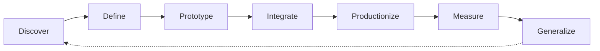

# Awesome FDE Resources

> A curated collection of tools, guides, projects, and learning resources
> for becoming a Forward Deployed Engineer.

# What Is a Forward Deployed Engineer?
A Forward Deployed Engineer (FDE) is a software engineer who works closely with customers to understand difficult real-world problems and build working solutions for them.
Unlike a traditional software engineer who mainly builds features from an internal product roadmap, an FDE works closer to the customer. They help identify the problem, design the solution, write and integrate the software, deploy it in the customer’s environment, and measure whether it creates value.
An FDE may:
- Interview users and understand their workflows
- Turn unclear business problems into technical requirements
- Build applications, integrations, data pipelines, or AI agents
- Connect products to APIs, databases, identity systems, and cloud platforms
- Test, deploy, monitor, and improve production systems
- Communicate with both technical and nontechnical stakeholders
- Convert customer-specific solutions into reusable product features

### The FDE Delivery Cycle

The exact responsibilities vary by company. Some FDEs focus on AI applications, while others specialise in product development, enterprise integration, infrastructure, security, industry-specific systems, or technical pre-sales. Therefore, an FDE role should be judged by its actual responsibilities—not only by its title.

## The Forward Deployed Engineer’s Quest

## Before You Begin — Engineering Foundations

## Week 1 — Learn How Systems Talk
