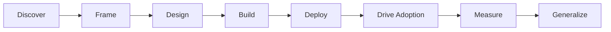

# Awesome FDE Resources

> A curated collection of resources for Forward Deployed Engineers who
> discover customer problems and deliver production AI solutions.

## Contents

- [What Is a Forward Deployed Engineer?](#what-is-a-forward-deployed-engineer)
- [The FDE Journey](#the-fde-journey)
- [Discover the Customer Problem](#discover-the-customer-problem)
- [Frame the Opportunity](#frame-the-opportunity)
- [Design the AI Solution](#design-the-ai-solution)
- [Build and Evaluate](#build-and-evaluate)
- [Deploy into the Enterprise](#deploy-into-the-enterprise)
- [Drive Adoption](#drive-adoption)
- [Measure Business Outcomes](#measure-business-outcomes)
- [Turn Field Learning into Product](#turn-field-learning-into-product)
- [Case Studies and Reference Implementations](#case-studies-and-reference-implementations)
- [FDE Careers and Teamcraft](#fde-careers-and-teamcraft)
- [Technical Foundations](#technical-foundations)

## What Is a Forward Deployed Engineer?

A Forward Deployed Engineer works closely with customers to understand
important operational problems and build solutions that create measurable
business value.

The role combines:

- Customer discovery and strategic advisory
- Software and AI engineering
- Enterprise integration and deployment
- Stakeholder communication and product judgment
- Adoption, measurement, and continuous improvement

## The FDE Journey

## Discover the Customer Problem

An FDE should not begin with a model, agent, or technical architecture. The
first step is to understand how the customer currently works, where the
problem occurs, and why it matters.

A customer’s initial request may describe a desired feature rather than the
underlying problem. Through conversations and observation, the FDE turns that
request into a clear problem statement supported by evidence.

### What the FDE Investigates

- Who experiences the problem?
- What outcome are they trying to achieve?
- How does the existing workflow operate?
- Where do delays, errors, costs, or repetitive tasks occur?
- Which systems, data, and teams are involved?
- What has already been attempted?
- What technical, security, or organizational constraints exist?
- How does the customer currently measure the problem?
- What would a successful outcome look like?
- Is AI actually necessary for solving it?

### Customer Discovery Activities

#### Stakeholder Interviews

Speak with users, decision-makers, technical teams, and process owners. Their
perspectives may differ, so the FDE should identify both shared goals and
conflicting expectations.

#### Workflow Observation

Examine how the work is actually completed instead of relying only on how the
process is described. Record the steps, handoffs, tools, decisions, delays,
exceptions, and manual workarounds.

#### Root-Cause Analysis

Separate visible symptoms from their underlying causes. A slow process, for
example, may result from missing data or approval bottlenecks rather than a
lack of automation.

#### Constraint Discovery

Identify limitations involving data access, privacy, security, compliance,
integrations, budget, deployment environments, and organizational readiness.

#### Success Definition

Agree on measurable outcomes before building. Useful measures might include
time saved, reduced error rates, faster resolution, increased completion
rates, lower costs, or improved user satisfaction.

### Customer Problem Brief

Before designing a solution, the FDE should be able to summarize:

> **[User or team] struggles to [complete an important activity] because
> [evidence-backed cause], resulting in [measurable impact]. A successful
> outcome would [observable improvement], subject to [important constraints].**

### Discovery Output

Customer discovery should produce:

- A clearly defined customer problem
- A map of the current workflow
- Identified users and stakeholders
- Evidence of the problem’s impact
- Known technical and organizational constraints
- Initial assumptions that still need validation
- Agreed success measures
- A decision on whether the opportunity should proceed

### Resources

- [Learning About Users and Their Needs](https://www.gov.uk/service-manual/user-research/start-by-learning-user-needs) — Guidance for identifying users, investigating how they currently work, and expressing needs as outcomes rather than proposed features.

- [Writing an Effective Guide for a User Interview](https://www.nngroup.com/articles/interview-guide/) — A practical process for preparing open-ended interview questions, follow-up prompts, and a pilot interview.

- [Creating an Experience Map](https://www.gov.uk/service-manual/user-research/creating-an-experience-map/) — Explains how to map users’ actions, experiences, pain points, teams, and service dependencies over time.

- [5 Whys Analysis](https://www.atlassian.com/team-playbook/plays/5-whys) — A facilitated exercise for investigating the underlying causes of a problem instead of responding only to its symptoms.

- [Framework for Innovation](https://www.designcouncil.org.uk/resources/framework-for-innovation/) — Introduces the Double Diamond approach for exploring a problem broadly, defining the right challenge, developing possibilities, and testing solutions.

## Frame the Opportunity

After discovering the customer’s problem, an FDE must decide whether it
represents a valuable and feasible opportunity—especially whether AI is an
appropriate part of the solution.

This stage converts discovery findings into a focused use case that the
customer and delivery team can evaluate.

### What the FDE Defines

- The users and workflow being addressed
- The business impact of the current problem
- The specific task AI might perform
- Why AI is preferable to rules, automation, or process improvement
- The data and system access required
- Expected quality, latency, cost, and safety requirements
- Human-review and escalation requirements
- Technical and organizational risks
- A small first deployment or pilot
- Measurable success and stop criteria

### Opportunity Assessment

Evaluate each proposed use case across:

| Dimension | Question |
| --- | --- |
| User value | Does this solve an important user problem? |
| Business impact | Will it save time, reduce cost, increase revenue, or reduce risk? |
| AI suitability | Does the task benefit from language, reasoning, generation, or classification? |
| Data readiness | Is relevant, lawful, and sufficiently reliable data available? |
| Technical feasibility | Can it integrate with the customer’s existing environment? |
| Risk | What happens when the system produces an incorrect result? |
| Adoption | Will users trust it and incorporate it into their workflow? |
| Measurability | Can improvement be demonstrated using agreed metrics? |
| Reusability | Could the solution or its components benefit other customers? |

### Opportunity Brief

Before designing the system, summarize the opportunity:

> **For [target users], we will improve [existing workflow] by using AI to
> [specific task]. We expect to improve [business or user measure] from
> [baseline] to [target]. The initial scope includes [boundaries], requires
> [data and integrations], and will use [human oversight] to manage
> [principal risks].**

### Resources

- [Identifying and Scaling AI Use Cases](https://openai.com/business/guides-and-resources/identifying-and-scaling-ai-use-cases/) — A practical guide to finding AI opportunities in business workflows and prioritizing them using expected impact and implementation effort.

- [Project Poster](https://www.atlassian.com/team-playbook/plays/project-poster) — A collaborative method for documenting the problem, assumptions, possible solutions, scope, and intended result before committing to delivery.

- [Define What Success Looks Like](https://www.gov.uk/service-manual/service-standard/point-10-define-success-publish-performance-data) — Guidance for selecting measures that demonstrate whether a service is solving its intended problem.
  
## Design the AI Solution
Once an opportunity is selected, the FDE designs how AI will fit into the
customer’s workflow.

The goal is not to make every step intelligent or autonomous. Predictable
steps should remain deterministic, while AI should be used where the task
requires interpreting unstructured information, handling ambiguity, or making
context-dependent decisions.

### Decompose the Workflow

Break the proposed workflow into individual tasks and identify:

- The input and expected output of each task
- Steps that can use deterministic rules or traditional software
- Steps that require model judgment
- Information the model needs
- External systems the solution must access
- Actions the system may perform
- Decisions requiring human approval
- Conditions that should stop or escalate the workflow

### Choose the Appropriate Pattern

| Pattern | Appropriate When |
| --- | --- |
| Prompted model | One model response can complete the task |
| Structured output | The result must follow a predictable schema |
| Retrieval-augmented generation | The model needs customer or domain knowledge |
| Tool-using workflow | The system must retrieve data or perform defined actions |
| Deterministic orchestration | The sequence of steps must remain predictable |
| Agent | The system must decide which steps or tools to use dynamically |
| Human-in-the-loop | Errors or actions could have significant consequences |

Start with the simplest pattern capable of meeting the customer’s requirements.
Additional autonomy also introduces additional evaluation, security, and
operational complexity.

### Design Decisions

The FDE should define:

- Model inputs and expected outputs
- Required customer context and grounding data
- Model and provider constraints
- Available tools and their permissions
- Workflow state and completion conditions
- Data retention and privacy requirements
- Human-review and escalation points
- Acceptable latency and operating cost
- Expected failure modes and fallback behaviour
- Initial evaluation criteria

### Solution Design Brief

Before implementation, document:

> **The solution uses [AI capability] to perform [specific tasks] within
> [customer workflow]. It receives [inputs and context], may use [tools and
> systems], and produces [expected output or action]. Deterministic software
> controls [predictable steps], while human approval is required for
> [high-risk decisions]. The solution succeeds when [evaluation criteria] are
> met within [latency, cost, and safety constraints].**

### Resources

- [A Practical Guide to Building AI Agents](https://openai.com/business/guides-and-resources/a-practical-guide-to-building-ai-agents/) — Explains when an agent is appropriate, how models, tools, and instructions fit together, and where guardrails and human intervention are required.

- [Building Effective AI Agents](https://www.anthropic.com/engineering/building-effective-agents) — Distinguishes fixed workflows from autonomous agents and recommends beginning with simple, composable patterns.

- [Application Design for AI Workloads](https://learn.microsoft.com/en-us/azure/well-architected/ai/application-design) — Architecture guidance covering AI application layers, deterministic orchestration, agents, knowledge sources, tools, and nonfunctional requirements.

### Cohort-Based Learning

- [Mastering Agentic AI](https://maven.com/aishwarya-srinivasan/mastering-ai-agents) — A cohort-based program covering
  LLM application foundations, RAG and context engineering, agent architectures, MCP and A2A, orchestration frameworks, fine-tuning, local models, AI evaluations, observability, security, and production readiness.
  Availability and enrollment dates may vary.
  *Created by [THE GEN ACADEMY], the maintainers of this collection.*
  
## Build and Evaluate

An FDE should build the smallest end-to-end version of the solution that can
be tested inside a realistic customer workflow.

The objective is not merely to produce a convincing demonstration. The FDE
must determine whether the system performs the intended task consistently,
handles important failures, and improves the customer outcome defined earlier.

### Build a Vertical Slice

The first implementation should connect the essential parts of the solution:

- A representative user input
- Relevant customer data and context
- The selected model or agent
- Required tools and integrations
- A usable output or completed action
- Human review where necessary
- Logging of model responses, tool calls, errors, latency, and cost

Use real or representative examples early. Artificial examples may hide the
language, exceptions, incomplete data, and operational constraints present in
the customer’s environment.

### Define the Evaluation Set

Create a collection of test cases that includes:

- Common customer tasks
- Important edge cases
- Previously observed failures
- Ambiguous or incomplete inputs
- Unsafe or adversarial inputs
- Tool and integration failures
- Cases that require human escalation
- Cases where the system should refuse or take no action

Each test case should have clear success criteria based on the customer’s
workflow and expected outcome.

### Choose Evaluation Methods

| Method | Best Used For |
| --- | --- |
| Deterministic checks | Formats, required fields, calculations, and tool outcomes |
| Reference-answer comparison | Tasks with known correct answers |
| Human evaluation | Usefulness, judgment, tone, and domain-specific quality |
| Model-based grading | Applying a defined rubric across many outputs |
| Trace review | Examining an agent’s decisions, tool calls, and intermediate steps |
| Outcome verification | Confirming that the intended real-world state was achieved |

Do not rely on one score alone. Combine automated evaluation with domain-expert
review and realistic workflow testing.

### Iterate Through Failures

For each meaningful failure:

1. Record the input, context, output, and execution trace.
2. Classify the cause of the failure.
3. Add the example to the evaluation set.
4. Change the prompt, context, tools, model, or workflow.
5. Run the complete evaluation set again.
6. Check that the change did not introduce regressions elsewhere.

### Build and Evaluation Output

Before moving toward deployment, the FDE should have:

- A working end-to-end solution
- A representative evaluation dataset
- Defined quality and safety criteria
- Baseline evaluation results
- Documented failure categories
- Tested human-review and escalation paths
- Recorded latency and cost measurements
- Evidence that the solution is ready for a limited customer pilot

### Resources

- [Working with Evals](https://developers.openai.com/api/docs/guides/evals) — Practical documentation for creating test datasets, defining evaluation criteria, running evaluations, and comparing system changes.

- [Demystifying Evals for AI Agents](https://www.anthropic.com/engineering/demystifying-evals-for-ai-agents) — A detailed guide to tasks, trials, graders, traces, outcomes, capability evaluations, and regression testing for agentic systems.

- [Production ML Systems: Deployment Testing](https://developers.google.com/machine-learning/crash-course/production-ml-systems/deployment-testing) — Explains why production AI systems require testing beyond model quality, including pipelines, serving infrastructure, and integration behaviour.

## Deploy into the Enterprise

## Drive Adoption

## Measure Business Outcomes

## Turn Field Learning into Product

## Case Studies and Reference Implementations

## FDE Careers and Teamcraft

## Technical Foundations
