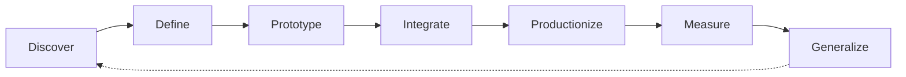

# Awesome FDE Resources

> A curated collection of tools, guides, projects, and learning resources
> for becoming a Forward Deployed Engineer.

# What Is a Forward Deployed Engineer?
A Forward Deployed Engineer (FDE) is a software engineer who works closely with customers to understand difficult real-world problems and build working solutions for them.
Unlike a traditional software engineer who mainly builds features from an internal product roadmap, an FDE works closer to the customer. They help identify the problem, design the solution, write and integrate the software, deploy it in the customer’s environment, and measure whether it creates value.
An FDE may:
- Interview users and understand their workflows
- Turn unclear business problems into technical requirements
- Build applications, integrations, data pipelines, or AI agents
- Connect products to APIs, databases, identity systems, and cloud platforms
- Test, deploy, monitor, and improve production systems
- Communicate with both technical and nontechnical stakeholders
- Convert customer-specific solutions into reusable product features

### The FDE Delivery Cycle

The exact responsibilities vary by company. Some FDEs focus on AI applications, while others specialise in product development, enterprise integration, infrastructure, security, industry-specific systems, or technical pre-sales. Therefore, an FDE role should be judged by its actual responsibilities—not only by its title.

## Before You Begin — Engineering Foundations

## Prerequisites — Engineering Foundations

> Start here if you are new to programming or software development. You do not need to master every topic before continuing, but you should be comfortable with the fundamentals.

### Python

- [The Python Tutorial](https://docs.python.org/3/tutorial/) — The official introduction to Python syntax, data structures, functions, modules, exceptions, and classes.
- [Automate the Boring Stuff with Python](https://automatetheboringstuff.com/) — A practical introduction to Python through small automation projects.

### Git and GitHub

- [Getting Started with Git](https://docs.github.com/en/get-started/learning-to-code/getting-started-with-git) — GitHub’s beginner guide to repositories, commits, branches, and pull requests.
- [Introduction to GitHub](https://github.com/skills/introduction-to-github) — A hands-on exercise completed inside a real GitHub repository.

### Command Line

- [Command Line Crash Course](https://developer.mozilla.org/en-US/docs/Learn_web_development/Getting_started/Environment_setup/Command_line) — An introduction to navigating directories, managing files, and running commands.
- [The Missing Semester: The Shell](https://missing.csail.mit.edu/2020/course-shell/) — A practical introduction to shells, paths, pipes, arguments, and command-line tools.

### JSON and HTTP

- [Working with JSON](https://developer.mozilla.org/en-US/docs/Learn_web_development/Core/Scripting/JSON) — Explains how JSON represents and exchanges structured information.
- [An Overview of HTTP](https://developer.mozilla.org/en-US/docs/Web/HTTP/Guides/Overview) — Introduces requests, responses, methods, headers, status codes, and clients.

### Environments and Packages

- [Installing Packages with pip and venv](https://packaging.python.org/en/latest/guides/installing-using-pip-and-virtual-environments/) — Shows how to isolate Python projects and manage their dependencies.
- [Python Environment Variables](https://docs.python.org/3/library/os.html#os.environ) — The official reference for reading environment variables in Python.

### Debugging and Testing

- [Python Debugging with pdb](https://docs.python.org/3/library/pdb.html) — The official guide to inspecting and debugging running Python programs.
- [Get Started with pytest](https://docs.pytest.org/en/stable/getting-started.html) — A short tutorial on writing and running automated Python tests.

### Ready to Continue?

You are ready for Week 1 when you can:

- Write and run a small Python program
- install a package inside a virtual environment
- navigate files using a terminal
- read a basic JSON object
- recognise an HTTP request and response
- create a Git commit and push it to GitHub
- write and run one basic automated test

## The Forward Deployed Engineer’s Quest

## Week 1 — Learn How Systems Talk
> Learn how applications exchange data, react to events, manage permissions,
> and store information.

# Enterprise Integration

## What is it?

Enterprise integration means connecting different applications, services, databases, and devices so that they can exchange information and support one complete business workflow.

For example, a customer-support solution might connect:

Support ticket system → AI service → customer database → Slack notification

These systems may belong to different companies, use different data formats, and require different authentication methods.

## Why does an FDE need it?

FDEs usually deploy solutions inside an organisation that already has many systems. They rarely get to build everything from scratch.
An FDE needs enterprise integration to:
- Connect a product to customer systems
- Move data safely between applications
- Work with old and modern software
- Translate incompatible data formats
- Automate multi-step business processes
- Handle permissions and security requirements
- Design for unavailable or unreliable external systems

Without integration knowledge, an FDE may build a good demonstration that cannot function inside the customer’s real environment.

## What should you learn?

Focus on:
- How data moves between systems
- Synchronous and asynchronous communication
- APIs and webhooks
- Messages, events, and queues
- Data transformation
- Authentication and permissions
- Integration workflows
- Handling failures and duplicate events
- Monitoring integrations
You only need a general understanding for now. APIs, webhooks and OAuth will each be covered separately.

#### Resources

- [Get Started with Integration Architecture Design](https://learn.microsoft.com/en-us/azure/architecture/integration/integration-start-here) — Introduces how applications, data, services, and devices are connected across enterprise environments.

- [Enterprise Integration Patterns](https://www.oneio.cloud/blog/what-are-enterprise-integration-patterns) — Provides standard patterns and terminology for solving recurring integration problems.

- [Messaging Patterns Overview](https://www.enterpriseintegrationpatterns.com/patterns/messaging/) — Explains how messages are created, transported, routed, and transformed between applications.

